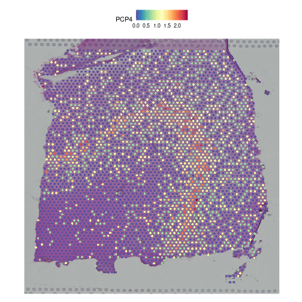
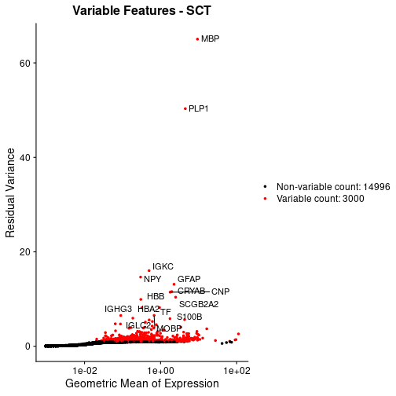

:::::::::::::::::::::::::::::::::::::: questions 

- How do we determine the necessity of normalization in spatial transcriptomics?
- What insights do additional modalities like H&E staining provide in assessing 
normalization needs?
- How do specific normalization techniques like SCTransform and log scaling work 
and when should they be applied?

::::::::::::::::::::::::::::::::::::::::::::::::

::::::::::::::::::::::::::::::::::::: objectives

- Assess the need for normalization using both spatial transcriptomics data and 
ancillary modalities like H&E staining.
- Understand the specific applications and mechanisms of normalization 
techniques such as SCTransform and log scaling.
- Implement adaptive normalization strategies that accurately reflect both 
absolute and relative cellular information.

::::::::::::::::::::::::::::::::::::::::::::::::


## Understanding Normalization in Spatial Transcriptomics

Normalization in spatial transcriptomics must be carefully tailored to each 
dataset, balancing the technical corrections with the preservation of 
biologically meaningful signals. There are two artifacts of the data that we 
need to adjust for: 

1. the difference in total counts across spots, and
2. the difference in variance across genes.

For the first goal, each spot may have a different number of total counts. This 
is termed the *library size*. Since each spot has a different number of counts,
it will be difficult to compare gene expression values between them in a
meaningful way because the denominator (total spot counts) is different in each
spot. On the other hand, different spots may contain different types of cells, 
which may express differing numbers of transcripts. So there is a balance 
between normalizing all spots to have the same total counts and leaving some 
variation in total counts which may be due to the biology of the tissue.

For the second goal, in order to compare gene expression values between 
different genes, the within-gene variance should be similar between genes. This
is because many statistical tests require that the within-group variance be the
same. As you'll see below, there is a relationship between the mean and
variance of genes that will allow us to correct for this difference. Hence,
we seek to *stabilize the variance* -- expression variance should be independent 
of mean expression.

### Total Counts per Spot are Variable 

Let's first assess the variability in the total counts per spot.

The spots are arranged in columns in the data matrix. We will look at the 
distribution of total counts per spot by summing the counts in each column and
making a histogram.


``` r
counts <- LayerData(filter_st, layer = 'counts')
hist(colSums2(counts), breaks = 100, 
     main = "Histogram of Counts per Spot")
```


As you can see, the total counts per spot ranges cross three orders of 
magnitude. Some of this may be due to the biology of the tissue, *i.e.* some 
cells may express more transcripts. But some of this may be due to technical 
issues. Let's explore each of these two considerations further.

### Sources of Biological Variation in Total Counts

Hematoxylin and Eosin (H&E) staining is critical for preliminary assessments of
tissue sections. It highlights structural and pathological features, guiding the
interpretation of transcriptomic data. For example, high RNA counts in a 
necrotic region, typically characterized by reduced cellular material, might 
suggest technical artifacts, indicating a need for normalization.

Maynard and colleagues used the information encoded in the H&E, in particular
cellular organization, morphology, and density, in conjunction with expression 
data to annotate the six layers and the white matter of the neocortex. 
Additionally, they applied standard image processing techniques to the H&E image 
to segment and count nuclei under each spot. They provide this as metadata. 
Let's load that layer annotation and cell count metadata and add it to our 
Seurat object.


``` r
spot_metadata <- read.table("./data/spot-meta.tsv", sep="\t")
# Subset to our sample
spot_metadata <- subset(spot_metadata, sample_name == 151673)
rownames(spot_metadata) <- spot_metadata$barcode
stopifnot(all(Cells(filter_st) %in% rownames(spot_metadata)))
spot_metadata <- spot_metadata[Cells(filter_st),]

filter_st <- AddMetaData(object = filter_st,
                         metadata = spot_metadata[, c("layer_guess", "cell_count"), drop=FALSE])
```

Now, we can plot the layer annotations to understand the structure of the 
tissue. We will use a simple wrapper, `SpatialDimPlotColorSafe`, around the 
Seurat function `SpatialDimPlot`. This is defined in `code/spatial_utils.R` and 
uses a color-blind safe palette.


``` r
SpatialDimPlotColorSafe(filter_st[, !is.na(filter_st[[]]$layer_guess)],
                        "layer_guess") + labs(fill="Layer")
```


We noted that the authors used cellular density to aid in discerning layers. 
Let's see those H&E-derived cell counts vary across layers.


``` r
g <- ggplot(na.omit(filter_st[[]][, c("layer_guess", "cell_count")]), 
            aes(x = layer_guess, y = cell_count))
g <- g + geom_boxplot() + xlab("Layer") + ylab("Cell Count")
g
```


We see that the white matter (WM) has increased cells per spot, whereas Layer 1 
has fewer cells per spot.

We can also plot these cell counts spatially.


``` r
SpatialFeaturePlot(filter_st, "cell_count")
```


The cell counts partially reflect the banding of the layers.

As a potential surrogate for cell count, let's plot the number of UMIs per spot 
as a function of layer.


``` r
g <- ggplot(na.omit(filter_st[[]][, c("layer_guess", "nCount_Spatial")]), 
            aes(x = layer_guess, y = nCount_Spatial))
g <- g + geom_boxplot()
g
```


Layer 1 has fewer UMIs, consistent with its lower cell count. An increase in 
UMIs consistent with that in cell count is not observed for the white matter, 
however. Despite this imperfect correlation between UMI and cell counts, we wish 
to emphasize that UMI (*i.e.*, read) counts, as well as feature (*i.e.*, gene) 
counts, can encode biological information. That certainly occurs here. As such,
we strongly recommend visualizing raw UMI and features counts prior to 
normalization.

### Normalization Techniques to Mitigate Sources of Technical Variation in Total Counts

#### "Counts Per Million" Library Size Normalization 

The first technical issue we noted above was a difference in total counts
or library size across spots. A straightfoward means of addressing this
is simply to divide all gene counts within the spot by the total counts in that
spot. Conventionally, we then multiply by a million, which yields 
"counts per million" (CPM). This approach is susceptible to "compositional
bias" -- if a small number of genes make a large contribution to the total
count, any significant fluctuation in their expression across samples will
impact the quantification of all other genes. To overcome this, more robust
measures of library size that are more resilient to compositional bias
are sometimes used, including the 75th percentile of counts within a sample 
(or here, spot). For simplicity, here we will use CPM.

In Seurat, we can apply this transformation via the `NormalizeData` function,
parameterized by the relative counts (or "RC") normalization method:


``` r
cpm_st <- NormalizeData(filter_st, 
                        assay                = "Spatial", 
                        normalization.method = "RC", 
                        scale.factor         = 1e6)
```

NormalizeData adds a `data` object to the Seurat object. 


``` r
Layers(cpm_st)
```

``` output
[1] "counts" "data"  
```

We can confirm that we have indeed normalized away differences in total 
counts -- all spots now having one million reads:


``` r
head(colSums(LayerData(cpm_st, "data")))
```

``` output
AAACAAGTATCTCCCA-1 AAACAATCTACTAGCA-1 AAACACCAATAACTGC-1 AAACAGAGCGACTCCT-1 
             1e+06              1e+06              1e+06              1e+06 
AAACAGCTTTCAGAAG-1 AAACAGGGTCTATATT-1 
             1e+06              1e+06 
```

WORKING: next goal is to show that cpms don't stabilize variance,
but FindVariableFeatures is not working with cpms.

Mean-variance plots are an essential tool for assessing gene expression 
variability relative to the mean expression levels across different spots. By 
plotting the variance of gene expression against the mean expression level, 
researchers can identify genes with variance that deviates significantly from 
what would be expected under normal biological conditions. This can be 
particularly useful for spotting genes that are overly influenced by technical 
artifacts or biological outliers, suggesting the corresponding normalization 
choices.


#### LogNormalize

One common approach that attempts to meet our two objectives above is 
log-transformation of normalized counts. The resulting values are often 
ambiguously referred to as log-normalized counts, which elides stating that the 
raw counts are first normalized or scaled and then log transformed. Scaling 
accounts for the differences in spot-specific RNA counts. The log transformation
reduces skewness caused by highly expressed genes and stabilizes the variance, 
at least for certain mean-variance relationships. In practice, the log 
transformation is applied to <i>1+x</i>, where <i>x</i> is the scaled expression 
value -- the so-called *log1p* transformation.

In Seurat, we can apply this transformation via the `NormalizeData` function:


``` r
lognorm_st <- NormalizeData(filter_st, 
                           assay                = "Spatial", 
                           normalization.method = "LogNormalize", 
                           scale.factor         = 1e6)
```

This function first normalizes the raw counts by `scale.factor` before applying 
the log1p transformation. The `scale.factor` argument has a default of 10,000. 
Here, we selected 1,000,000 because it made the mean-variance relationship 
somewhat flatter. The normalized counts, in this case, are CPMs -- counts per 
million. 

Log normalization adds a `data` object to the Seurat object. 


``` r
Layers(lognorm_st)
```

``` output
[1] "counts" "data"  
```

Our goal is that the variance should be stabilized -- *i.e.*, independent of the 
mean. Let's plot this *mean-variance* relationship with the
[`VariableFeaturePlot`](https://satijalab.org/seurat/reference/variablefeatureplot) 
function. We aim for a flat line, indicating no trend between mean and variance. 
We can compare this diagnostic plot across normalization methods to compare them 
on our given dataset. Additionally, let's highlight highly variables genes on 
this plot. 


``` r
lognorm_st <- FindVariableFeatures(lognorm_st)
top15        <- head(VariableFeatures(lognorm_st), 15)
plot_lognorm <- VariableFeaturePlot(lognorm_st) + 
                  ggtitle("Variable Features - Log normalization")
plot_lognorm <- LabelPoints(plot = plot_lognorm, points = top15, repel = TRUE)
plot_lognorm
```


As a sanity check that the normalization is something sensible, let's look 
at the expression of two, known layer-restricted marker genes -- MOBP and PCP4.
MOBP is restricted to the white matter, while PCP4 is expressed in Layer 5.


``` r
SpatialFeaturePlot(lognorm_st, slot="data", c("MOBP"))
```


``` r
SpatialFeaturePlot(lognorm_st, slot="data", c("PCP4"))
```


Indeed, this is what we observe.

#### SCTransform

[`SCTransform`](https://satijalab.org/seurat/articles/sctransform_vignette.html) 
is a normalization method for single-cell and spatial transcriptomics that uses 
a regularized negative binomial regression to stabilize variance across 
expression levels
([Choudhary et al., Genome Biol 23, 27 (2022)](https://link.springer.com/article/10.1186/s13059-021-02584-9)). 
It selects highly variable genes and corrects for technical 
noise by modeling gene expression counts with Pearson residuals. This approach 
effectively adjusts for confounding factors such as sequencing depth, 
facilitating more accurate downstream analyses like clustering.


``` r
filter_st <- SCTransform(filter_st, assay = "Spatial")
```

The `SCTransform` method added a new assay called *SCT*.


``` r
Assays(filter_st)
```

``` output
[1] "Spatial" "SCT"    
```

It made this new assay the default. Be aware that Seurat functions often operate 
on the `DefaultAssay`.


``` r
DefaultAssay(filter_st)
```

``` output
[1] "SCT"
```

Within this new *SCT* Assay, `SCTransform` has created three `Layers` to store
data. These are different from the neocortical layers presented earlier.  


``` r
Layers(filter_st)
```

``` output
[1] "counts"     "data"       "scale.data"
```

As you can see by reading its documentation, these new `Layers` are `counts` 
(counts corrected for differences in sequencing depth between cells), `data`
(`log1p` transformation of the corrected counts), and `scale.data` (scaled 
Pearson residuals, *i.e.*, the difference between an observed count and its 
expected value under the model used by `SCTransform`, divided by the standard 
deviation in that count under the model).

{alt='A diagram of the sttructure of a Seurat object showing the assays (Spatial & SCT) and Layers (counts, data & scale.data.'}


``` r
?SCTransform
```

Notice, in particular, that the `counts` Layers in the *Spatial* and *SCT* 
Assays are different. As mentioned above, the latter have been corrected for 
differences in sequencing depth between cells. As such, the distribution in 
total counts per cell is much more uniform in the latter case.


``` r
layout(matrix(1:2, ncol = 1))
raw_counts_spatial <- LayerData(filter_st, layer = "counts", assay = "Spatial")
hist(colSums2(raw_counts_spatial), main = "Raw counts (Spatial)")

corrected_counts_sct <- LayerData(filter_st, layer = "data", assay = "SCT")
hist(colSums2(corrected_counts_sct), main = "Corrected counts (SCT)")
```


Let's plot the mean-variance relationship.


``` r
top15SCT    <- head(VariableFeatures(filter_st), 15)
plot_sct    <- VariableFeaturePlot(filter_st) + 
                 ggtitle("Variable Features - SCT")
plot_sct    <- LabelPoints(plot = plot_sct, points = top15SCT, repel = TRUE)
plot_sct
```


The geometric mean (mean of the log counts) is shown on the X-axis and the
residual variance is on the Y-axis. Each point shows one gene. By default, 
Seurat selects a set of 3,000 variable genes which are colored in red. The 
variance is largely stable across a range of mean expression values.

Let's again check that the two marker genes show the appropriate 
layer-restricted expression.


``` r
SpatialFeaturePlot(filter_st, slot="data", c("MOBP"))
```


``` r
SpatialFeaturePlot(filter_st, slot="data", c("PCP4"))
```




::::::::::::::::::::::::::::::::::::: challenge 

## Challenge 1: Compare Mean-Variance Plots

Above, we created mean-variance plots for the SCT and Log normalizations.
Which method does a better job of stabilizing the variance across genes?
Turn to the person next to you and put the Log-normalized plot on one of your
screens and the SCT transform plot on the other person's screen. Discuss the 
mean-variance relationship in each plot and decide which one you think 
stabilizes the variance across genes better.

:::::::::::::::::::::::: solution 

## Solution 1
 
In the Log-normalization plot, the variation in the variance is wider for genes
with lower expression and lower for genes with higher expression. Also, the
range of variances is quite wide. In the SCT plot, the variance of the low-
expressed genes is smaller and it rises as mean expression increases. The 
height of the variances becomes stable for genes with mean expression over about
100. For this reason, we prefer the SCT transform.

:::::::::::::::::::::::::::::::::
:::::::::::::::::::::::::::::::::::::

### Comparing Normalizations

:::::::::::::::::::::::::::::::::::::::::::::::::::::::::::::::::::: instructor

Don't have the students type this. Show the plots and discuss them.

::::::::::::::::::::::::::::::::::::::::::::::::::::::::::::::::::::::::::::::::

First, let's look at the total counts per spot after normalization by each
method. The normalized counts are stored in the "data" slot of the Seurat 
object.


``` r
layout(matrix(1:2, ncol = 1))
counts_log <- LayerData(lognorm_st, layer = "data")
hist(colSums2(counts_log), main = "Log-norm")

counts_sct <- LayerData(filter_st, layer = "data")
hist(colSums2(counts_sct), main = "SCT")
```


Notice that the log-normalization has a range of total counts per spot that
ranges across several orders of magnitude. The SCT transform has a more uniform
distribution of total counts and spans a factor of three, from ~1000 to ~2700.

Next, we will compare the mean-variance plots between the two methods.


``` r
plot_lognorm
```


``` r
plot_sct
```



### No One-Size-Fits-All Approach

Raw read counts provide essential insights into the absolute cell type densities
within a sample, which are crucial for mapping cellular distribution. In 
contrast, normalized data adjusts for technical variations like sequencing depth
and RNA capture efficiency, thus revealing the relative proportions of cell 
types and identifying specific tissue structures, such as epithelium or 
fibrosis. Saiselet et al. demonstrated that while normalized data effectively 
identify distinct morphologies, raw counts are vital for detecting areas with 
unusual cell-type concentrations, such as high epithelial regions expressing 
vimentin (VIM) (Saiselet, M., et al., Journal of Molecular Cell Biology, 2020).
Hence, choosing the right normalization method depends on the specific
characteristics of each dataset and the biological questions at hand.
Researchers must understand the impact of each normalization strategy on both 
the biological and technical aspects of their data.


::::::::::::::::::::::::::::::::::::: keypoints 

- Normalization is essential but must be selectively applied based on the unique 
characteristics of each dataset and the specific biological questions at hand.
- Techniques like SCTransform and log scaling offer ways to balance technical 
correction with biological integrity.
- Examining both raw and normalized data can provide comprehensive insights into
the absolute and relative characteristics of cellular components in spatial 
transcriptomics.

::::::::::::::::::::::::::::::::::::::::::::::::


