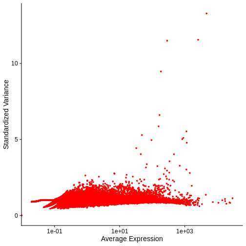

:::::::::::::::::::::::::::::::::::::: questions 

- How do we determine the necessity of normalization in spatial transcriptomics?
- What insights do additional modalities like H&E staining provide in assessing 
normalization needs?
- How do specific normalization techniques like SCTransform and log scaling work 
and when should they be applied?

::::::::::::::::::::::::::::::::::::::::::::::::

::::::::::::::::::::::::::::::::::::: objectives

- Assess the need for normalization using both spatial transcriptomics data and 
ancillary modalities like H&E staining.
- Understand the specific applications and mechanisms of normalization techniques
such as SCTransform and log scaling.
- Implement adaptive normalization strategies that accurately reflect both 
absolute and relative cellular information.

::::::::::::::::::::::::::::::::::::::::::::::::


## Understanding Normalization in Spatial Transcriptomics

Normalization in spatial transcriptomics must be carefully tailored to each 
dataset, balancing the technical corrections with the preservation of 
biologically meaningful signals. There are two artifacts of the data that we 
need to adjust for: 

1. the difference in total counts across spots, and
2. the difference in variance across genes.

For the first point, each spot may have a different number of total counts, 
which makes it difficult to compare gene expression levels between spots. On the
other hand, different spots may contain different types of cells, which may 
express differing numbers of transcripts. So there is a balance between 
normalizing all spots to have the same total counts and leaving some variation
in total counts which may be due to the biology of the tissue.

For the second point, in order to compare gene expression values between 
different genes, the within-gene variance should be similar between genes. This
is because many statistical tests require that the within-group variance be the
same. As you'll see below, there is a relationship between the mean and
variance of genes that will allow us to correct for this difference.

### Using Raw Data to Guide Interpretation Prior to Normalization

Hematoxylin and Eosin (H&E) staining is critical for preliminary assessments of
tissue sections. It highlights structural and pathological features, guiding the
interpretation of transcriptomic data. For example, high RNA counts in a 
necrotic region, typically characterized by reduced cellular material, might 
suggest technical artifacts, indicating a need for normalization.


Maynard and colleagues used the information encoded in the H&E, in particular
cellular organization, morphology, and density, in conjunction with expression data
to annotate the six layers and the white matter of the neocortex. Additionally,
they applied standard image processing techniques to the H&E image to segment and
count nuclei under each spot. They provide this as metadata. Let's load that layer
annotation and cell count metadata and add it to our Seurat object.


``` r
spot_metadata <- read.table("./data/spot-meta.tsv", sep="\t")
# Subset to our sample
spot_metadata <- subset(spot_metadata, sample_name == 151673)
rownames(spot_metadata) <- spot_metadata$barcode
stopifnot(all(Cells(filter_st) %in% rownames(spot_metadata)))
spot_metadata <- spot_metadata[Cells(filter_st),]

filter_st <- AddMetaData(object = filter_st, metadata = spot_metadata[, c("layer_guess", "cell_count"), drop=FALSE])

SpatialDimPlotColorSafe(filter_st[, !is.na(filter_st[[]]$layer_guess)], "layer_guess") + labs(fill="Layer")
```


Now, we can plot the layer annotations to understand the structure of the tissue.
We will use a simple wrapper, SpatialDimPlotColorSafe, around the Seurat function SpatialDimPlot.
This is defined in code/spatial_utils.R and uses a color-blind safe palette.


``` r
SpatialDimPlotColorSafe(filter_st[, !is.na(filter_st[[]]$layer_guess)], "layer_guess") + labs(fill="Layer")
```


We noted that the authors used cellular density to aid in discerning layers. Let's see those H&E-derived
cell counts vary across layers.


``` r
g <- ggplot(na.omit(filter_st[[]][, c("layer_guess", "cell_count")]), aes(x = layer_guess, y = cell_count))
g <- g + geom_boxplot() + xlab("Layer") + ylab("Cell Count")
print(g)
```


We see that the white matter (WM) has increased cells per spot, whereas Layer 1 has fewer cells per spot.

We can also plot these cell counts spatially.


``` r
SpatialFeaturePlot(filter_st, "cell_count")
```


The cell counts partially reflect the banding of the layers.

As a potential surrogate for cell count, let's plot the number of UMIs per spot as a function of layer.


``` r
g <- ggplot(na.omit(filter_st[[]][, c("layer_guess", "nCount_Spatial")]), aes(x = layer_guess, y = nCount_Spatial))
g <- g + geom_boxplot()
print(g)
```


Layer 1 has fewer UMIs, consitent with its lower cell count. An increase in UMIs consistent with that in cell count
is not observed for the white matter, however. Despite this imperfect correlation between UMI and cell counts,
we wish the emphasie that UMI (i.e., read) counts, as well as feature (i.e., gene) counts, can encode biological information.
That certainly
occurs here. As such, we strongly recommend visualizing raw UMI and features counts prior to normalization.

### Assessing Normalization Needs

#### Total Counts per Spot

The spots are arranged in column in the data matrix. We will look at the 
distribution of total counts per spot by summing the counts in each column and
making a histogram.


``` r
counts <- LayerData(filter_st, layer = 'counts')
hist(colSums2(counts), breaks = 100, 
     main = "Histogram of Counts per Spot")
```


As you can see, the total counts per spot ranges cross three orders of 
magnitude. Some of this may be due to the biology of the tissue, i.e. some cells
may express more transcripts. But some of this may be due to technical issues.

#### Mean-Variance Plotting

Mean-variance plots are an essential tool for assessing gene expression 
variability relative to the mean expression levels across different spots. By 
plotting the variance of gene expression against the mean expression level, 
researchers can identify genes with variance that deviates significantly from 
what would be expected under normal biological conditions. This can be 
particularly useful for spotting genes that are overly influenced by technical 
artifacts or biological outliers, suggesting the corresponding normalization 
choices.

In the raw counts, each spot will have different total number of counts. This 
is termed the "library size". Since each spot has a different number of counts,
it will be difficult to compare gene expression values between them in a
meaningful way because the denominator (total spot counts) is different in each
spot.

### Normalization Techniques and Their Implications

#### SCTransform

[SCTransform](https://satijalab.org/seurat/articles/sctransform_vignette.html) 
is a normalization method for single-cell and spatial transcriptomics that uses 
a regularized negative binomial regression to stabilize variance across 
expression levels
[Choudhary et al.](https://link.springer.com/article/10.1186/s13059-021-02584-9). 
It selects highly variable genes and corrects for technical 
noise by modeling gene expression counts with Pearson residuals. This approach 
effectively adjusts for confounding factors such as sequencing depth, 
facilitating more accurate downstream analyses like clustering.


``` r
filter_st <- SCTransform(filter_st, 
                         assay = "Spatial")
```

``` output
Running SCTransform on assay: Spatial
```

``` output
Running SCTransform on layer: counts
```

``` output
vst.flavor='v2' set. Using model with fixed slope and excluding poisson genes.
```

``` warning
Warning: replacing previous import 'S4Arrays::makeNindexFromArrayViewport' by
'DelayedArray::makeNindexFromArrayViewport' when loading 'SummarizedExperiment'
```

``` output
Variance stabilizing transformation of count matrix of size 17996 by 3633
```

``` output
Model formula is y ~ log_umi
```

``` output
Get Negative Binomial regression parameters per gene
```

``` output
Using 2000 genes, 3633 cells
```

``` output
Found 105 outliers - those will be ignored in fitting/regularization step
```

``` output
Second step: Get residuals using fitted parameters for 17996 genes
```

``` output
Computing corrected count matrix for 17996 genes
```

``` output
Calculating gene attributes
```

``` output
Wall clock passed: Time difference of 21.12774 secs
```

``` output
Determine variable features
```

``` output
Centering data matrix
```

``` output
Set default assay to SCT
```

The SCTransform method added a new Assay called "SCT."


``` r
Assays(filter_st)
```

``` output
[1] "Spatial" "SCT"    
```

It made this new Assay the default. Be aware that Seurat functions often operate on the DefaultAssay.


``` r
DefaultAssay(filter_st)
```

``` output
[1] "SCT"
```

Within this new "SCT" Assay, SCTransform has created three Layers. 


``` r
Layers(filter_st)
```

``` output
[1] "counts"     "data"       "scale.data"
```

As you can see by reading its documentation, these new Layers are "counts" (counts corrected
for differences in sequencing depth between cells), "data" (`log1p` transformation or (log(1+x)) of the corrected counts), 
and "scale.data" (scaled Pearson residuals, i.e., the difference between an observed count
and its expected value under the model used by SCTransform, divided by the standard deviation
in that count under the model).


``` r
?SCTransform
```

Notice, in particular, that the "counts" Layers in the "Spatial" and "SCT" Assays are
different. As mentioned above, the latter have been corrected for differences in sequencing
depth between cells. As such, the distribution in total counts per cell is much more
uniform in the latter case.


``` r
layout(matrix(1:2, ncol = 1))
raw_counts_spatial <- LayerData(filter_st, layer = "counts", assay = "Spatial")
hist(colSums2(raw_counts_spatial), main = "Raw counts (Spatial)")

corrected_counts_sct <- LayerData(filter_st, layer = "data", assay = "SCT")
hist(colSums2(corrected_counts_sct), main = "Corrected counts (SCT)")
```


Let's plot the mean versus the variance of the genes using the 
[VariableFeaturePlot](https://satijalab.org/seurat/reference/variablefeatureplot) 
function. 


``` r
VariableFeaturePlot(filter_st, log = NULL) + 
  ggtitle("Variable Features - SCT")
```


The geometric mean (mean of the log counts) is shown on the X-axis and the
residual variance is on the Y-axis. Each point shows one gene. By default, Seurat selects a set
of 3,000 variable genes which are colored in red. The variance is largely
stable across a range of mean expression values.

#### LogNormalize

LogNormalize is a specific normalization method that scales gene expression data
to account for differences in spot-specific total RNA counts. This process 
involves dividing the raw gene expression counts in each spot by the total
counts in that cell, multiplying by a scale factor, and then applying a natural
logarithm transformation using log1p (log(x+1)). This method helps in reducing
the skewness caused by highly expressed genes and stabilizes the variance across
the dataset, making it more suitable for downstream analytical comparisons.


``` r
lognorm_st <- NormalizeData(filter_st, 
                           assay                = "Spatial", 
                           normalization.method = "LogNormalize", 
                           scale.factor         = 1e6)
```

``` output
Normalizing layer: counts
```

In this normalization, feature counts for each spot are divided by the total 
counts for that spot and multiplied by the scale.factor. This is then 
natural-log transformed using log1p (log(x + 1)). The "scale.factor" argument
has a default of 10,000. Here, we selected 1,000,000 because it made the mean-
variance relationship somewhat flatter.

The Log Normalization adds a "data" object to the Seurat object. Note that,
unlike SCTransform, NormalizeData does not set the DefaultAssay, so we need to do
explicitly.


``` r
DefaultAssay(lognorm_st) <- "Spatial"
Layers(lognorm_st)
```

``` output
[1] "counts" "data"  
```


``` r
lognorm_st <- FindVariableFeatures(lognorm_st,  
                                  assay            = 'Spatial', 
                                  selection.method = "mean.var.plot",
                                  nfeatures        = 3000)
```

``` output
Finding variable features for layer data
```

``` r
VariableFeaturePlot(lognorm_st, log = NULL) + 
  ggtitle("Variable Features - Log-norm")
```

``` warning
Warning: Removed 1 row containing missing values or values outside the scale range
(`geom_point()`).
```



It is not entirely clear what is plotted on each axis. As best we can tell,
the mean is on the X-axis and the standardized variance is on the Y-axis.

Our goal is to maintain consistent variance across average gene expression 
levels. Ideally, when plotting variance against mean expression, we aim for a 
straight, flat line. This comparison helps us determine which normalization 
method best suits our data. 

::::::::::::::::::::::::::::::::::::: challenge 

## Challenge 1: Compare Mean-Variance Plots

Above, we created mean-variance plots for the SCT and Log normalizations.
Which method does a better job of stabilizing the variance across genes?
Turn to the person next to you and put the Log-normalized plot on one of your
screens and the SCT transform plot on the other person's screen. Discuss the 
mean-variance relationship in each plot and decide which one you think 
stabilizes the variance across genes better.

:::::::::::::::::::::::: solution 

## Solution 1
 
In the Log-normalization plot, the variation in the variance is wider for genes
with lower expression and lower for genes with higher expression. Also, the
range of variances is quite wide. In the SCT plot, the variance of the low-
expressed genes is smaller and it rises as mean expression increases. The 
height of the variances becomes stable for genes with mean expression over about
100. For this reason, we prefer the SCT transform.

:::::::::::::::::::::::::::::::::
:::::::::::::::::::::::::::::::::::::

### Comparing Normalizations

:::::::::::::::::::::::::::::::::::::::::::::::::::::::::::::::::::: instructor

Don't have the students type this. Show the plots and discuss them.

::::::::::::::::::::::::::::::::::::::::::::::::::::::::::::::::::::::::::::::::

First, let's look at the total counts per spot after normalization by each
method. The normalized counts are stored in the "data" slot of the Seurat 
object.


``` r
layout(matrix(1:2, ncol = 1))
counts_log <- LayerData(lognorm_st, layer = "data")
hist(colSums2(counts_log), main = "Log-norm")

counts_sct <- LayerData(filter_st, layer = "data")
hist(colSums2(counts_sct), main = "SCT")
```


Notice that the log-normalization has a range of total counts per spot that
ranges across several orders of magnitude. The SCT transform has a more uniform
distribution of total counts and spans a factor of three, from ~1000 to ~2700.

Next, we will compare the mean-variance plots between the two methods.


``` r
top15 <- head(VariableFeatures(lognorm_st), 15)
plot1 <- VariableFeaturePlot(lognorm_st, log = NULL) + 
           ggtitle("Variable Features - Log normalization")
plot1 <- LabelPoints(plot = plot1, points = top15, repel = TRUE)
```

``` output
When using repel, set xnudge and ynudge to 0 for optimal results
```

``` r
top15SCT <- head(VariableFeatures(filter_st), 15)
plot2    <- VariableFeaturePlot(filter_st) + 
              ggtitle("Variable Features - SCT")
plot2    <- LabelPoints(plot = plot2, points = top15SCT, repel = TRUE)
```

``` output
When using repel, set xnudge and ynudge to 0 for optimal results
```

``` r
plot1
```

``` warning
Warning: Removed 1 row containing missing values or values outside the scale range
(`geom_point()`).
```


``` r
plot2
```


### No One-Size-Fits-All Approach

Raw read counts provide essential insights into the absolute cell type densities
within a sample, which are crucial for mapping cellular distribution. In 
contrast, normalized data adjusts for technical variations like sequencing depth
and RNA capture efficiency, thus revealing the relative proportions of cell 
types and identifying specific tissue structures, such as epithelium or 
fibrosis. Saiselet et al. demonstrated that while normalized data effectively 
identify distinct morphologies, raw counts are vital for detecting areas with 
unusual cell-type concentrations, such as high epithelial regions expressing 
vimentin (VIM) (Saiselet, M., et al., Journal of Molecular Cell Biology, 2020).
Hence, choosing the right normalization method depends on the specific
characteristics of each dataset and the biological questions at hand.
Researchers must understand the impact of each normalization strategy on both 
the biological and technical aspects of their data.


::::::::::::::::::::::::::::::::::::: keypoints 

- Normalization is essential but must be selectively applied based on the unique 
characteristics of each dataset and the specific biological questions at hand.
- Techniques like SCTransform and log scaling offer ways to balance technical 
correction with biological integrity.
- Examining both raw and normalized data can provide comprehensive insights into
the absolute and relative characteristics of cellular components in spatial 
transcriptomics.

::::::::::::::::::::::::::::::::::::::::::::::::


