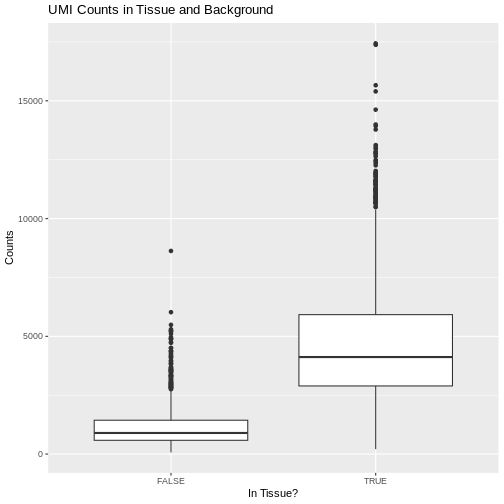

:::::::::::::::::::::::::::::::::::::: questions 

- What data files should I expect from the Visium assay?
- Which data preprocessing steps are required to prepare the raw data files for 
further analysis?
- What software will we use for data preprocessing?

::::::::::::::::::::::::::::::::::::::::::::::::

::::::::::::::::::::::::::::::::::::: objectives

- Explain how to use markdown with the new lesson template
- Demonstrate how to include pieces of code, figures, and nested challenge blocks

::::::::::::::::::::::::::::::::::::::::::::::::

## Introduction

The 
[`Space Ranger`](https://www.10xgenomics.com/support/software/space-ranger) 
software is a popular, though by no means only, set of pipelines 
for preprocessing of Visium data. We focus on it here. It provides the following 
output: 

| File Name	 | Description |
|------------|-------------|
| web_summary.html	| Run summary metrics and plots in HTML format |
| cloupe.cloupe	| Loupe Browser visualization and analysis file |
| spatial/	| Folder containing outputs that capture the spatiality of the data. |
| spatial/aligned_fiducials.jpg	| Aligned fiducials QC image |
| spatial/aligned_tissue_image.jpg	| Aligned CytAssist and Microscope QC image. Present only for CytAssist workflow |
| spatial/barcode_fluorescence_intensity.csv	| CSV file containing the mean and standard deviation of fluorescence intensity for each spot and each channel. Present for the fluorescence image input specified by --darkimage |
| spatial/cytassist_image.tiff	| Input CytAssist image in original resolution that can be used to re-run the pipeline. Present only for CytAssist workflow |
| spatial/detected_tissue_image.jpg	| Detected tissue QC image. |
| spatial/scalefactors_json.json	| Scale conversion factors for spot diameter and coordinates at various image resolutions |
| spatial/spatial_enrichment.csv	| Feature spatial autocorrelation analysis using Moran's I in CSV format |
| spatial/tissue_hires_image.png	| Downsampled full resolution image. The image dimensions depend on the input image and slide version |
| spatial/tissue_lowres_image.png	| Full resolution image downsampled to 600 pixels on the longest dimension |
| spatial/tissue_positions.csv	| CSV containing spot barcode; if the spot was called under (1) or out (0) of tissue, the array position, image pixel position x, and image pixel position y for the full resolution image |
| analysis/	| Folder containing secondary analysis data including graph-based clustering and K-means clustering (K = 2-10); differential gene expression between clusters; PCA, t-SNE, and UMAP dimensionality reduction. |
| metrics_summary.csv	| Run summary metrics in CSV format |
| probe_set.csv	| Copy of the input probe set reference CSV file. Present for Visium FFPE and CytAssist workflow |
| possorted_genome_bam.bam	| Indexed BAM file containing position-sorted reads aligned to the genome and transcriptome, annotated with barcode information |
| possorted_genome_bam.bam.bai	| Index for possorted_genome_bam.bam. In cases where the reference transcriptome is generated from a genome with very long chromosomes (>512 Mbp), Space Ranger v2.0+ generates a possorted_genome_bam.bam.csi index file instead. |
| filtered_feature_bc_matrix/	| Contains only tissue-associated barcodes in MEX format. Each element of the matrix is the number of UMIs associated with a feature (row) and a barcode (column). This file can be input into third-party packages and allows users to wrangle the barcode-feature matrix (*e.g.* to filter outlier spots, run dimensionality reduction, normalize gene expression). |
| **filtered_feature_bc_matrix.h5**	| **Same information as filtered_feature_bc_matrix/ but in HDF5 format.** |
| raw_feature_bc_matrices/	| Contains all detected barcodes in MEX format. Each element of the matrix is the number of UMIs associated with a feature (row) and a barcode (column). |
| **raw_feature_bc_matrix.h5**	| **Same information as raw_feature_bc_matrices/ in HDF5 format.** |
| raw_probe_bc_matrix.h5	| Contains UMI counts of each probe for all detected barcodes in HDF5 format. Only produced when running pipelines for probe-based assays. |
| molecule_info.h5	| Contains per-molecule information for all molecules that contain a valid barcode, valid UMI, and were assigned with high confidence to a gene or protein barcode. This file is required for additional analysis spaceranger pipelines including aggr, targeted-compare and targeted-depth. |

Fortunately, you will not need to look at all of these files. We provide a brief 
description for you in case you are curious or need to look at one of the files 
for technical reasons.

The two files that you will use are `raw_feature_bc_matrix.h5` and
`filtered_feature_bc_matrix.h5`. These files have an `h5` suffix, which means 
that they are HDF5 files.
[`HDF5`](https://www.hdfgroup.org/solutions/hdf5/) is a compressed file format
for storing complex high-dimensional data. HDF5 stands for *Hierarchical Data 
Formats, version 5*. There is an R package designed to read and write HDF5 files 
called [`rhdf5`](https://bioconductor.org/packages/release/bioc/html/rhdf5.html).
This was one of the packages which you installed during the lesson setup.
  
Briefly, `HDF5` organizes data into directories within the compressed file. There
are three "files" within the `HDF5` file:

| File Name     | Description |
|---------------|-------------|
| features.csv  | Contains the features (*i.e.* genes in this case) for each row in the data matrix.|
| barcodes.csv  | Contains the probe barcodes for each spot on the tissue block. |
| matrix.mtx    | Contains the counts for each gene in each spot. Features (*e.g.* genes) are in rows and barcodes (*e.g.* spots) are in columns. |

## Set up Environment

Go to the `File` menu and select `Open Project`. Open the `spatialRNA` 
project which you created in the workshop setup. 

First, we will load in some utility functions to make our lives a bit easier. 
The 
[`source`](https://www.rdocumentation.org/packages/base/versions/3.6.2/topics/source) 
function reads an R file and runs the code in it. In this case, this will load 
several useful functions.

We will then load the libraries that we need for this lesson.


``` r
suppressPackageStartupMessages(library(tidyverse))
suppressPackageStartupMessages(library(hdf5r))
suppressPackageStartupMessages(library(Seurat))

source("https://raw.githubusercontent.com/smcclatchy/spatial-transcriptomics/main/code/spatial_utils.R")
```

## Load Raw and Filtered Spatial Expression Data

In this course, we will use the [Seurat](https://satijalab.org/seurat/) R 
environment, which was originally designed for analysis of single-cell RNA-seq 
data, but has been extended for spatial transcriptomics data. The Seurat website 
provides helpful 
[vignettes](https://satijalab.org/seurat/articles/get_started_v5_new) 
and a concise command 
[cheat sheet](https://satijalab.org/seurat/articles/essential_commands). 
[`SpatialExperiment`](https://bioconductor.org/packages/release/bioc/html/SpatialExperiment.html) 
in R and [`scanpy`](https://scanpy.readthedocs.io/en/stable/) in python, amongst 
others, are also frequently used in analyzing spatial transcriptomics data.

We will use the 
[`Load10X_Spatial`](https://www.rdocumentation.org/packages/Seurat/versions/5.0.1/topics/Load10X_Spatial) 
function from Seurat to read in the spatial transcriptomics data. These are the 
data which you downloaded in the setup section.

First, we will read in the raw data for sample 151673.


``` r
raw_st <- Load10X_Spatial(data.dir      = "./data/151673", 
                          filename      = "151673_raw_feature_bc_matrix.h5",
                          filter.matrix = FALSE)
```

If you did not see any error messages, then the data loaded in and you should 
see an `raw_st` object in your `Environment` tab on the right.

:::::::::::::::::::::::::::::::::::::::::::::::::::::::::::::::::::: instructor

If the data does not load in correctly, verify that the students used the 
mode = "wb" argument in download.file() during the Setup. We have found that
Windows users have to use this.

::::::::::::::::::::::::::::::::::::::::::::::::::::::::::::::::::::::::::::::::


Let's look at `raw_st`, which is a Seurat object.


``` r
raw_st
```

``` output
An object of class Seurat 
33538 features across 4992 samples within 1 assay 
Active assay: Spatial (33538 features, 0 variable features)
 1 layer present: counts
 1 spatial field of view present: slice1
```


The output says that we have 33,538 *features* and 4,992 *samples* with one 
assay. *Feature* is a generic term for anything that we measured. In this case, 
we measured gene expression, so each feature is a gene. Each *sample* is one
spot on the spatial slide. So this tissue sample has 33,538 genes assayed
across 4,992 spots.

An experiment may have more than one *assay*. For example, you may run both RNA
sequencing and chromatin accessibility in the same set of samples. In this case,
we have one assay -- RNA-seq. Each assay will, in turn, have one or more
*layers*. Each layer stores a different form of the data. Initially, our Seurat
object has a single *counts* layer, holding the raw, un-normalized RNA-seq 
counts for each spot. Subsequent downstream analyses can populate other layers, 
including normalized counts (conventionally stored in a *data* layer) or 
variance-stabilized counts (conventionally stored in a *scale.data* layer).

There is also a single image called *slice1* attached to the Seurat object.

Next, we will load in the filtered data. Use the code above and look in
a file browser to identify the `filtered` file for sample 151673.

::::::::::::::::::::::::::::::::::::: challenge 

## Challenge 1: Read in filtered HDF5 file for sample 151673.

Open a file browser and navigate to `Desktop/spatialRNA/data/151673`. Can you 
find an HDF5 file (with an `.h5` suffix) that has the word "filtered" in it?

If so, read that file in and assign it to a variable called `filter_st`.

:::::::::::::::::::::::: solution 

## Solution 1
 

``` r
filter_st <- Load10X_Spatial(data.dir = "./data/151673", 
                             filename = "151673_filtered_feature_bc_matrix.h5")
```

::::::::::::::::::::::::::::::::::
:::::::::::::::::::::::::::::::::::::::::::::::::::

Once you have the filtered data loaded in, look at the object.


``` r
filter_st
```

``` output
An object of class Seurat 
33538 features across 3639 samples within 1 assay 
Active assay: Spatial (33538 features, 0 variable features)
 1 layer present: counts
 1 spatial field of view present: slice1
```

The raw and filtered data both have the same number of genes (33,538). But the
two objects have different numbers of spots. The raw data has 4,992 spots and 
the filtered data has 3,639 spots.

Look at the H&E slide below and notice the grey *fiducial* spots around the 
border. These are used by the spatial transcriptomics software to *register* the 
H&E image and the spatially-barcoded sequences.

{alt='H & E slide of sample 151673'}

::::::::::::::::::::::::::::::::::::: challenge 

## Challenge 2: How does the computer know how to orient the image?

Look carefully at the spots in the H&E image above. Are the spots symmetric?
Is there anything different about the spots that might help a computer to 
assign up/down and left/right to the image?

:::::::::::::::::::::::: solution 

## Solution 2
 
Look at the spots in each corner. In the upper-left, you will see the following
patterns:

{alt='Diagram showing tissue and registration spots in corners'}

The patterns in each corner allow the spatial transcriptomics software to 
orient the slide.

:::::::::::::::::::::::::::::::::
:::::::::::::::::::::::::::::::::

## Add Spot Metadata

The 10x Space Ranger pipeline automatically segments the tissue to identify it
within the background of the slide. This information is encoded in the
"tissue positions" file. Each row in the file corresponds to a spot.
The first column indicates whether the spot was (1) or was not (0) identified
as being within the tissue region by the segmentation procedure.
This file does not contain column names in earlier
versions of Space Ranger, but does starting with version 
[`SpaceRanger 2.0`](https://www.10xgenomics.com/support/software/space-ranger/latest/analysis/outputs/spatial-outputs).


``` r
tissue_position <- read_csv("./data/151673/spatial/tissue_positions_list.csv",
                            col_names = FALSE, show_col_types = FALSE) %>% 
                     column_to_rownames('X1')
colnames(tissue_position) <- c("in_tissue", 
                               "array_row", 
                               "array_col", 
                               "pxl_row_in_fullres", 
                               "pxl_col_in_fullres")
```

It is important to note that the order of the spots differs between the Seurat 
object and the tissue position file. We need to reorder the tissue positions to 
match the Seurat object. We can extract the spot barcodes using the
[`Cells`](https://satijalab.org/seurat/reference/cells) function. This is 
named for the earlier versions of Seurat, which processed single cell 
transcriptomic data. In this case, we are getting **spot** IDs, even though the 
function is called `Cells`.

Next, we will add the tissue positions to the Seurat object's metadata. Note
that Seurat will align the spot barcodes in this process.


``` r
raw_st    <- AddMetaData(object = raw_st,    metadata = tissue_position)
filter_st <- AddMetaData(object = filter_st, metadata = tissue_position)
```

Next, we will plot the spot annotation, indicating spots that are in the tissue
in blue and background spots in red.


``` r
SpatialPlot(raw_st, group.by = "in_tissue", alpha = 0.3)
```

<div class="figure" style="text-align: center">

<p class="caption">Spots identified in Tissue and Background</p>
</div>
The 10x platform tags each molecule with a Unique Molecular Identifier (UMI). 
This allows us to keep only one unique sequencing read per molecule and to 
exclude those arising from PCR duplication. We expect most of the UMI counts to 
be in the tissue spots.  The Seurat object metadata contains the UMI count in 
each spot in a column called `nCount_Spatial`. Let's plot the UMI counts in the 
tissue and background spots.


``` r
raw_st@meta.data %>%
  ggplot(aes(as.logical(in_tissue), nCount_Spatial)) +
    geom_boxplot() +
    labs(title = 'UMI Counts in Tissue and Background',
         x     = 'In Tissue?',
         y     = 'Counts')
```

<div class="figure" style="text-align: center">

<p class="caption">UMI Counts in Tissue and Background</p>
</div>

As expected, we see most of the counts in the tissue spots.

We can also plot the number of genes detected in each spot. Seurat calls genes
*features*, so we will plot the `nFeature_Spatial` value. This is stored in the
metadata of the Seurat object.


``` r
raw_st@meta.data %>%
  ggplot(aes(as.logical(in_tissue), nFeature_Spatial)) +
    geom_boxplot() +
    labs(title = 'Number of Genes in Tissue and Background',
         x     = 'In Tissue?',
         y     = 'Number of Genes')
```

<div class="figure" style="text-align: center">

<p class="caption">Number of Genes in Tissue and Background</p>
</div>

::::::::::::::::::::::::::::::::::::: challenge 

## Challenge 3: Why might there be UMI counts outside of the tissue boundaries?

We expect UMI counts in the spots which overlap with the tissue section.
What reasons can you think of that might lead UMI counts to occur in the
background spots?

:::::::::::::::::::::::: solution 

## Solution 3
 
1. When the tissue section is lysed, some transcripts may leak out of the cells
and into the background region of the slide.

:::::::::::::::::::::::::::::::::
:::::::::::::::::::::::::::::::::

Up to this point, we have been working with the raw, unfiltered data to show you 
how the spots are filtered. However, in most workflows, you will work directly 
with the filtered file. From this point forward, we will work with the filtered 
data object.

Let's plot the spots in the tissue in the filtered object to verify that it is
only using spots in the tissue.


``` r
plot1 <- SpatialDimPlot(filter_st, alpha = c(0, 0)) + 
           NoLegend()
plot2 <- SpatialDimPlot(filter_st) + 
           NoLegend()
plot1 | plot2
```


## Plot UMI and Gene Counts across Tissue

Next, we want to look at the distribution of UMI counts and numbers of genes in 
each spot across the tissue. This can be helpful in identifying technical issues 
with the sample processing.

It is useful to first think about what we expect. In the publication
associated with this data, the authors show the structure that they expect in 
this tissue section of the human dorsolateral prefrontal cortex (DLPFC). In the 
figure below, they show a series of layers, from L1 to L6, arranged from the 
upper right to the lower left. In the lower left corner, they expect to see 
*White Matter* (WM). So we expect to see some series of layers arranged from
the upper right to the lower left.

<!-- {alt="Figure 1c"} -->
 
We will use Seurat's 
[`SpatialFeaturePlot`](https://satijalab.org/seurat/reference/spatialplot) 
function to look at these values. We can color the spots based on the spot
metadata stored in the Seurat object. You can find these column names by looking 
at the `meta.data` slot of the Seurat object.


``` r
head(filter_st@meta.data)
```

``` output
                      orig.ident nCount_Spatial nFeature_Spatial in_tissue
AAACAAGTATCTCCCA-1 SeuratProject           8458             3586         1
AAACAATCTACTAGCA-1 SeuratProject           1667             1150         1
AAACACCAATAACTGC-1 SeuratProject           3769             1960         1
AAACAGAGCGACTCCT-1 SeuratProject           5433             2424         1
AAACAGCTTTCAGAAG-1 SeuratProject           4278             2264         1
AAACAGGGTCTATATT-1 SeuratProject           4004             2178         1
                   array_row array_col pxl_row_in_fullres pxl_col_in_fullres
AAACAAGTATCTCCCA-1        50       102               8468               9791
AAACAATCTACTAGCA-1         3        43               2807               5769
AAACACCAATAACTGC-1        59        19               9505               4068
AAACAGAGCGACTCCT-1        14        94               4151               9271
AAACAGCTTTCAGAAG-1        43         9               7583               3393
AAACAGGGTCTATATT-1        47        13               8064               3665
```

To plot the UMI counts, we will use the `nCount_Spatial` column in the
spot metadata.


``` r
plot1 <- SpatialDimPlot(filter_st, alpha = c(0, 0)) + 
           NoLegend()
plot2 <- SpatialFeaturePlot(filter_st, features = "nCount_Spatial")
plot1 | plot2
```

<div class="figure" style="text-align: center">

<p class="caption">UMI Counts in each Spot</p>
</div>

In this case, we see a band of higher counts running from upper left to lower 
right. There are also bands of lower counts above and below this band. The band 
in the upper right corner may be due to the fissure in the tissue. It is less 
clear why the expression is low in the lower-left corner.

We can also look at the number of genes detected in each spot using 
`nFeature_Spatial`.


``` r
plot1 <- SpatialDimPlot(filter_st, alpha = c(0, 0)) + 
           NoLegend()
plot2 <- SpatialFeaturePlot(filter_st, features = "nFeature_Spatial")
plot1 | plot2
```

<div class="figure" style="text-align: center">

<p class="caption">Number of Genes in each Spot</p>
</div>

It is difficult to lay out a broad set of rules that will work for all types of
tissues and samples. Some tissues may have homogeneous UMI counts across the 
section, while others may show variation in UMI counts due to tissue structure. 
For example, in cancer tissue sections, stromal cells tend to have lower counts 
than tumor cells and this should be evident in a UMI count plot. In the brain 
sample below, we might expect some variation in UMI counts in different layers 
of the brain.

## Removing Genes with Low Expression

In order to build this lesson, we needed to reduce the size of the data. To
do this, we are going to filter out genes that have no expression across the 
cells.

How many genes to we have before filtering?


``` r
paste(nrow(filter_st), "genes.")
```

``` output
[1] "33538 genes."
```

Next, we will get the raw counts, calculate the sum of each gene's exprsssion
across all spots, and filter the Seurat object to retain genes with summed
counts greater than zero.


``` r
counts     <- LayerData(filter_st, 'counts')
gene_sums  <- rowSums(counts)
keep_genes <- which(gene_sums > 0)

filter_st  <- filter_st[keep_genes,]
```

``` warning
Warning: Not validating Centroids objects
Not validating Centroids objects
```

``` warning
Warning: Not validating FOV objects
Not validating FOV objects
Not validating FOV objects
Not validating FOV objects
Not validating FOV objects
Not validating FOV objects
```

``` warning
Warning: Not validating Seurat objects
```

How many genes to we have after filtering?


``` r
paste(nrow(filter_st), "genes.")
```

``` output
[1] "21842 genes."
```

So we removed about 11,700 genes that had zero counts.

## Conclusion

::::::::::::::::::::::::::::::::::::: keypoints 

- The 10x Space Ranger pipeline provides you with an unfiltered and a filtered 
data file.
- The HDF5 file ends with an `h5` extension and contains the barcodes,
features (genes), and counts matrix.
- Seurat is one of several popular environments for analyzing spatial 
transcriptomics data.
- It is important to know something about the structure of the tissue which
you are analyzing.
- Plotting total counts and genes in each spot may help to identify quality
control issues.

::::::::::::::::::::::::::::::::::::::::::::::::


