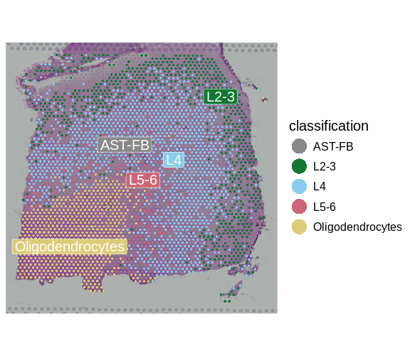

:::::::::::::::::::::::::::::::::::::: questions 

- How can we bring single-cell resolution to multi-cellular spatial 
transcriptomics spots?
- What are different algorithmic approaches for doing so?

::::::::::::::::::::::::::::::::::::::::::::::::

::::::::::::::::::::::::::::::::::::: objectives

- Explain spot deconvolution.
- Perform deconvolution to quantify different cell types in spatial 
transcriptomics spots using a supervised approach that employs scRNA-seq data.

::::::::::::::::::::::::::::::::::::::::::::::::


## Deconvolution in Spatial Transcriptomics

Each spatial spot in an ST experiment generally contains multiple cells. For 
example, spots in the Visium assay are 55 microns in diameter, whereas a typical 
T cell has a diameter of ~10 microns.
As such, the expression read out from the spot mixes together the expression of 
the individual cells encompassed by it. Deconvolution is the approach for 
unmixing this combined expression signal. Most often, deconvolution methods 
predict the fraction of each spot's expression derived from each particular cell 
type. Supervised methods deconvolve spot expression using cell type expression 
profiles (*e.g.*, from scRNA-seq) or marker genes. Unsupervised approaches instead 
infer the expression of the cell types first.

{alt='alt text for accessibility purposes'}
<a href="https://www.sciencedirect.com/science/article/pii/S200103702200558X#f0015">Zhang et al,  Comput Struct Biotechnol J 21, 176–184 (2023)</a>
<a href="https://creativecommons.org/licenses/by-nc-nd/4.0/" rel="license">CC BY-NC-ND 4.0</a>

## Deconvolution with Robust Cell Type Decomposition (RCTD) 

We will deconvolve spots by applying Robust Cell Type Decomposition (RCTD; 
[Cable, D. M., et al., Nature Biotechnology, 2021](https://www.ncbi.nlm.nih.gov/pmc/articles/PMC8606190)),
which is implemented in the [`spacexr`](https://github.com/dmcable/spacexr) 
package. The algorithm uses scRNA-seq data as a reference to deconvolve the 
spatial transcriptomics data, estimating the proportions of different cell types
in each spatial spot. RCTD models the observed gene expression in each spatial 
spot as a mixture of the gene expression profiles of different cell types, where 
the estimated proportions are the coefficients of the expression profiles in a 
linear model. Its procedure guarantees the <em>estimated</em> proportions are 
non-negative, but not that they sum to one. RCTD can operate in several modes: 
in `doublet` mode it fits at most two cell types per spot, in `full` mode it 
fits potentially all cell types in the reference per spot, and in `multi` mode 
it again fits more than two cell types per spot by extending the `doublet` 
approach. Here, we will use `full` mode.

## Loading scRNA-seq reference data

First, we load the scRNA-seq data that will serve as a reference for
deconvolution. Individual cells are assumed to be annotated according to their 
type. RCTD will use these cell type-specific expression profiles to deconvolve 
each spot's expression. Please note the use of 
[`fread`](https://www.rdocumentation.org/packages/data.table/versions/1.15.4/topics/fread) 
from the data.table package. This provides an efficient means of loading large 
data tables in csv and tsv format.


``` r
# # Load scRNA-seq data
sc.counts <- fread("data/scRNA-seq/sc_counts.tsv.gz") %>%
               column_to_rownames('V1') %>%
               as.matrix()

# Load cell type annotations
sc.metadata   <- read.delim("data/scRNA-seq/sc_cell_types.tsv")
sc.cell.types <- setNames(factor(sc.metadata$Value), sc.metadata$Name)

# Verify that the barcodes in counts and cell types match.
stopifnot(colnames(sc.counts) == names(sc.cell.types))
```

Next, we will create the reference object encapsulating this scRNA-seq data.
We will use the [`Reference`](https://rdrr.io/github/dmcable/RCTD/man/Reference.html) function, which
will organize and store the scRNA-seq data for the next steps.


``` r
sc_reference <- Reference(sc.counts, sc.cell.types)
```

## Applying RCTD for spot deconvolution

Let's write a wrapper function that performs RCTD deconvolution. This will 
facilitate running RCTD on other samples within this dataset. 
It calls [`SpatialRNA`](https://rdrr.io/github/dmcable/RCTD/man/SpatialRNA.html)
to create an object representing the ST data, much as we did for the
scRNA-seq data with `Reference` above. It then links the ST and scRNA-seq in an
RCTD object created with [`create.RCTD`](https://rdrr.io/github/dmcable/RCTD/man/create.RCTD.html)
and finally performs deconvolution by calling [`run.RCTD`](https://rdrr.io/github/dmcable/RCTD/man/run.RCTD.html).


``` r
run.rctd <- function(reference, st.obj) {
  
  # Get raw ST counts
  st.counts <- GetAssayData(st.obj, assay = "Spatial", layer = "counts")
  
  # Get the spot coordinates
  st.coords           <- st.obj[[]][, c("array_col", "array_row")]
  colnames(st.coords) <- c("x","y")
    
  # Create the RCTD 'puck', representing the ST data
  puck   <- SpatialRNA(st.coords, st.counts)

  myRCTD <- create.RCTD(puck, reference, max_cores = 1, 
                        keep_reference = TRUE)

  # Run deconvolution -- note that we are using 'full' mode to devolve a spot 
  # into (potentially) all available cell types.
  myRCTD <- suppressWarnings(run.RCTD(myRCTD, doublet_mode = 'full'))
  
  myRCTD
}
```

## Running Deconvolution on Brain Samples

We apply the RCTD wrapper to our spatial transcriptomics data to deconvolve the 
spots and quantify the cell types. This may take ~10 minutes. If you prefer, 
you can load the precomputed results directly.


``` r
# Change this variable to TRUE to load precomputed results, or FALSE to 
# compute the results here.
load.precomputed.results <- TRUE

rds.file <- paste0("data/rctd-sample-1.rds")

if(!load.precomputed.results || !file.exists(rds.file)) {

  result_1 <- run.rctd(sc_reference, filter_st)
  
  # The RCTD file is large. To save space, we will remove the reference 
  # counts. This is necessary owing to constraints on sizes of files 
  # uploaded to github during the automated build of this site. It will 
  # not be required for your own analyses.
  # We use the remove.RCTD.reference.counts utility function defined in 
  # code/spatial_utils.R.
  result_1 <- remove.RCTD.reference.counts(result_1)
  
  saveRDS(result_1, rds.file)

} else {

  result_1 <- readRDS(rds.file)

}
```

## Interpreting Deconvolution Results

RCTD outputs the proportion of different cell types in each spatial spot. These 
are held in the `spatialRNA@counts` slot. Let's see the proportions it predicts 
for this sample:


``` r
props <- as.data.frame(result_1@results$weights)
head(props)
```

``` output
                      AST-FB         L2-3           L4         L5-6
AAACAAGTATCTCCCA-1 0.2906892 1.989539e-01 3.568361e-01 9.495123e-04
AAACAATCTACTAGCA-1 0.3665241 4.652610e-04 4.652610e-04 4.601510e-01
AAACACCAATAACTGC-1 0.1069532 5.473749e-05 5.473749e-05 5.473749e-05
AAACAGAGCGACTCCT-1 0.3845201 4.758347e-01 3.256827e-04 3.256827e-04
AAACAGCTTTCAGAAG-1 0.2411203 3.694851e-01 1.995963e-01 6.646586e-04
AAACAGGGTCTATATT-1 0.2096408 3.256827e-04 3.624793e-04 5.117059e-01
                   Oligodendrocytes
AAACAAGTATCTCCCA-1       0.04291383
AAACAATCTACTAGCA-1       0.12784650
AAACACCAATAACTGC-1       1.25940541
AAACAGAGCGACTCCT-1       0.06181266
AAACAGCTTTCAGAAG-1       0.23374357
AAACAGGGTCTATATT-1       0.46602478
```

Notice that the proportions don't sum exactly to one:


``` r
head(rowSums(props))
```

``` output
AAACAAGTATCTCCCA-1 AAACAATCTACTAGCA-1 AAACACCAATAACTGC-1 AAACAGAGCGACTCCT-1 
         0.8903426          0.9554521          1.3665228          0.9228188 
AAACAGCTTTCAGAAG-1 AAACAGGGTCTATATT-1 
         1.0446099          1.1880596 
```

Let's classify each spot according to the layer type with highest proportion:


``` r
props$classification <- colnames(props)[apply(props, 1, which.max)]
```

Let's add the deconvolution results to our Seurat object, so that they can be 
visualized and analyzed alongside other data organized there.


``` r
filter_st <- AddMetaData(object = filter_st, metadata =  props)
```

We can now visualize the predicted layer classifications and compare them 
alongside the authors' annotations that we saw previously.


``` r
SpatialDimPlotColorSafe(filter_st[, !is.na(filter_st[[]]$classification)], 
                        "classification")
```




``` r
SpatialDimPlotColorSafe(filter_st[, !is.na(filter_st[[]]$layer_guess)], 
                        "layer_guess")
```


To be more quantitative, we can compute a confusion matrix comparing the layers 
predicted by RCTD with those annotated by the authors. 


``` r
df            <- as.data.frame(table(filter_st[[]]$layer_guess, 
                                     filter_st[[]]$classification))
colnames(df)  <- c("Annotation", "Prediction", "Freq")
df$Annotation <- factor(df$Annotation)
df$Prediction <- factor(df$Prediction)

ggplot(data = df, aes(x = Annotation, y = Prediction, fill = Freq)) + 
  geom_tile() +
  theme(text = element_text(size = 20), 
        axis.text.x = element_text(angle = 45, vjust = 1, hjust=1))
```


Note that there is a fairly strong correlation between the predicted and 
observed layers, particularly for the pairs Oligodendrocytes and WM 
(White Matter), L4 and Layer 4, and L2-3 and Layer 3.

## Summary

Deconvolution quantifies the cell type composition of each spot. Doing so 
enables downstream analyses, such as the proportion of various cell types across 
a sample, heterogeneity of cell types across the sample, or co-localization 
analyses of cell types within the sample. Supervised (*i.e.*, reference-based) and 
unsupervised approaches have been developed. 

Here, we applied deconvolution supervised by scRNA-seq annotations, as 
implemented in RCTD, to a brain sample. The highly structured organization of 
the brain allows clear visual confirmation of deconvolution results. Other 
tissues may have less structure and more intermingling of cell types. For 
example, a typical use of deconvolution in a cancer setting is to explore 
co-localization of tumor and immune cells.

:::::::::::::::::::::::::::::::::: keypoints

- Deconvolution enhances spatial transcriptomics by quantifying the different 
cell types within spatial spots.
- Integrating scRNA-seq data with spatial transcriptomics data facilitates 
accurate deconvolution.
- RCTD is a supervised deconvolution method that quantifies the proportion of 
different cell types in spatial transcriptomics data.

:::::::::::::::::::::::::::::::::::::::::::::


