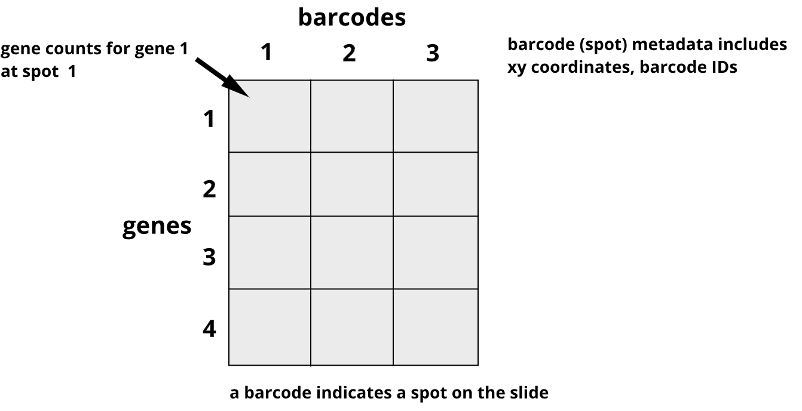

:::::::::::::::::::::::::::::::::::::: questions 

- Which data will we explore in this course?
- How was the study that generated the data designed?
- What are some critical design elements for rigorous, reproducible spatial transcriptomics experiments?

::::::::::::::::::::::::::::::::::::::::::::::::

::::::::::::::::::::::::::::::::::::: objectives

- Describe a spatial transcriptomics experiment.
- Identify important elements for good experimental design.

::::::::::::::::::::::::::::::::::::::::::::::::

## The Data

Recall that tissue is laid on a glass slide containing spots with primers to
capture mRNA. Each spot has a barcode ID indicating its position on the slide.

{alt='A graphic showing printed spots on a glass slide that are identified by a barcode and that contain primers to capture messenger RNA from the tissue laid on top of them'}

Cropped from 
<a href="https://commons.wikimedia.org/wiki/User:Jasquatch">James Chell</a>, <a href="https://commons.wikimedia.org/wiki/File:Spatial_transcriptomics_ii.png">Spatial transcriptomics ii</a>, <a href="https://creativecommons.org/licenses/by-sa/4.0/legalcode" rel="license">CC BY-SA 4.0</a>

Data from the 10X Genomics Visium platform contain gene identifiers in rows
and barcode identifiers in columns. In the graphic below, row 1 of column 1 
contains the mRNA counts for gene 1 at barcode (spot) 1.

{alt='An example of spatial transcriptomics data showing genes in rows and barcodes (spots) in columns'}


::::::::::::::::::::::::::::::::::::: challenge 

## Challenge 1: Row and column sums

What does the sum of a single row signify?  
What does the sum of a single column signify?  

:::::::::::::::::::::::: solution 

Row sum
 
```r
sum('data[1, ]')
```

Column sum
 
```r
sum('data[ , 1]')
```
::::::::::::::::::::::::

:::::::::::::::::::::::::::::::::::::

## Study design


## Important considerations for rigorous, reproducible spatial transcriptomics experiments


::::::::::::::::::::::::::::::::::::: keypoints 

- Use `.md` files for episodes when you want static content
- Use `.Rmd` files for episodes when you need to generate output
- Run `sandpaper::check_lesson()` to identify any issues with your lesson
- Run `sandpaper::build_lesson()` to preview your lesson locally

::::::::::::::::::::::::::::::::::::::::::::::::

