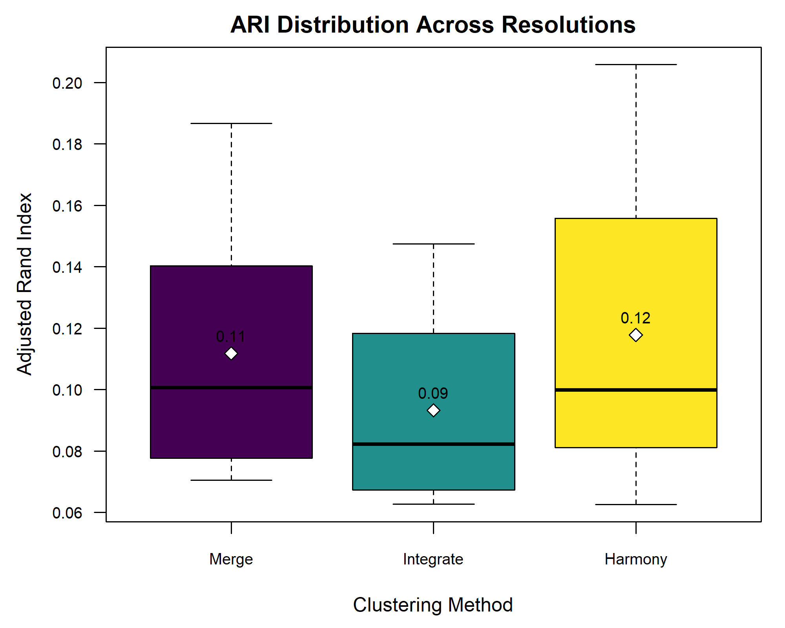

:::::::::::::::::::::::::::::::::::::: questions 

- How can we assess region-specific gene expression using differential 
expression?
- How can we assess spatially varying gene expression using spatial statistics?
::::::::::::::::::::::::::::::::::::::::::::::::

::::::::::::::::::::::::::::::::::::: objectives

- Identify differentially expressed genes across different layers defined by 
expert annotations.
- Utilize the Moran's I statistic to find spatially variable genes.
- Explore the relationship between layer-specific genes identified by 
differential expression and spatially varying genes identified by Moran's I.

::::::::::::::::::::::::::::::::::::::::::::::::

```{r setup, include=FALSE}
suppressPackageStartupMessages(library(tidyverse))
suppressPackageStartupMessages(library(presto))
suppressPackageStartupMessages(library(Seurat))
suppressPackageStartupMessages(library(ComplexHeatmap))
suppressPackageStartupMessages(library(rcartocolor))
suppressPackageStartupMessages(library(data.table))
suppressPackageStartupMessages(library(patchwork))
suppressPackageStartupMessages(library(DESeq2))
suppressPackageStartupMessages(library(harmony))
suppressPackageStartupMessages(library(mclust))

source("../code/spatial_utils.R")

sct_st <- load_seurat_object(file_prefix = 'deconcelltypes')
DefaultAssay(sct_st) <- "SCT"
```

## Spot-level Differential Expression Across Annotated Regions

We will begin by performing differential expression (DE) across the annotated 
layers. We will use the source publication's spot annotation, which is stored in 
the `layer_guess` column of the metadata. As a reminder, those look like:

```{r layers,warning=FALSE,message=FALSE}
SpatialDimPlotColorSafe(sct_st[, !is.na(sct_st[[]]$layer_guess)], 
                        "layer_guess") + 
  labs(fill = "Layer") 
```

We identify genes that are upregulated in each annotated brain region using the 
[`FindAllMarkers`](https://satijalab.org/seurat/reference/findallmarkers) 
function in Seurat. This performs a "one versus rest" comparison of a gene's 
expression in one region relative to that gene's expression in all other 
regions. The default test used here, the Wilcoxon Rank Sum test, will use an 
efficient implementation within the 
[`presto`](https://github.com/immunogenomics/presto) library, if installed. The 
speedup over the default implementation is substantial, and we highly recommend 
installing `presto` and using Seurat v5, which leverages it.

```{r layer-de}
Idents(sct_st)  <- "layer_guess"
de_genes           <- FindAllMarkers(sct_st, 
                                     assay    = "SCT",
                                     verbose  = FALSE,
                                     only.pos = TRUE, 
                                     min.pct  = 0.25, 
                                     logfc.threshold = 0.25)
```

The resulting table indicates DE p-values and adjusted p-values for each gene,
along with the percentage of spots in which the gene was detected (pct.1) 
in the corresponding cluster and the percentage of spots in which it was
detected in all <em>other</em> clusters (pct.2):

```{r layer-degs}
head(de_genes)
```

It is not uncommon to have pathologist annotations of regions. The Visium assay 
is performed on a tissue that is also stained for hematoxylin and eosin (H&E) -- 
a routine practice in pathology for diagnosing cancer, for example. A 
pathologist could manually annotate this H&E image using a histology viewer, 
such as QuPath.

## Spot-level Differential Expression Across Clusters

In cases where we do not have expert annotations, we could perform the analysis 
above across clusters. Indeed, this is often the first step to interpreting a 
cluster -- comparing its marker genes to those of regions expected within the 
tissue. It is important to remember, however, that these markers are for 
clusters of spots -- aggregations of cells -- not individual cells, as would be 
the case in scRNA-seq. Those aggregations may be of cells with similar types, in 
which case analysis may be similar to that of scRNA-seq, or of different cell 
types, in which case the interpretation would be quite different than with 
scRNA-seq. Let's try this.

First, let's remind ourselves what the clusters look like:

```{r clusters,warning=FALSE,message=FALSE}
SpatialDimPlotColorSafe(sct_st, "seurat_clusters") + 
  labs(fill = "Cluster") 
```

Now, we will use nearly identical code as above to perform the differential 
expression analysis. We only change each cell's identity class with the 
[`Idents`](https://satijalab.github.io/seurat-object/reference/Idents.html) 
function, to associate each cell with its cluster.

```{r layer-de-cluster}
Idents(sct_st)  <- "seurat_clusters"
de_genes_cluster   <- FindAllMarkers(sct_st, 
                                     assay    = "SCT",
                                     verbose  = FALSE,
                                     only.pos = TRUE, 
                                     min.pct  = 0.25, 
                                     logfc.threshold = 0.25)
```

Let's visualize the overlap between genes differentially expressed across 
annotated layers and those differentially expressed across clusters. We will do 
so using a confusion matrix.

```{r de-comparison-confusion}
de_genes_all <- merge(subset(de_genes, p_val_adj < 0.05),
                      subset(de_genes_cluster, p_val_adj < 0.05),
                      by=c("gene"), all=TRUE, 
                      suffixes = c(".anno", ".cluster"))
layer.order <- c("WM", "Layer1", "Layer2", "Layer3", "Layer4", 
                 "Layer5", "Layer6")
df            <- as.data.frame(table(de_genes_all$cluster.anno, 
                                     de_genes_all$cluster.cluster))
colnames(df)  <- c("de.anno", "de.cluster", "Freq")
df$de.anno <- factor(df$de.anno, levels = c("NA", layer.order))
df$de.cluster <- factor(df$de.cluster)

ggplot(data = df, aes(x = de.anno, y = de.cluster, fill = Freq)) +
  geom_tile() +
  theme(text = element_text(size = 20), 
        axis.text.x = element_text(angle = 45, vjust = 1, hjust=1)) +
  xlab("Annotation-based DE Genes") + ylab("Cluster-based DE Genes")
```

The above plot shows only marginal overlap between the annotation-derived DE 
genes on the x axis and the cluster-derived DE genes on the y axis. This might 
indicate that the two approaches are complementary. In fact, they could be used 
in conjunction. We could have performed clustering <em>within</em> the annotated 
regions to assess intra-layer heterogeneity.

## Moran's I Statistic

We next consider an alternative to the above approaches that both rely on 
defined regions -- be they defined from expert annotation or via clustering. 
Instead, we will apply the Moran's I statistic. Moran's I is a measure used to 
assess spatial autocorrelation in data, indicating whether similar values of a 
feature (*e.g.*, expression levels of a gene) are clustered, dispersed, or 
random 
([Jackson, et al. 2010](https://ij-healthgeographics.biomedcentral.com/articles/10.1186/1476-072X-9-33)). 
These correspond to Moran's I values that are positive, negative, or near zero, 
respectively.

![Moran's I statistic quantifies spatial correlation. **Top Left:** Checkerboard pattern results in negative Moran's I, indicating anti-correlation. **Top Right:** Linear gradient shows a high positive Moran's I, reflecting a strong spatial gradient. **Bottom Left:** Random pattern leads to a Moran's I near zero, suggesting no significant spatial autocorrelation. **Bottom Right:** 'Ink blot' pattern demonstrates positive autocorrelation, indicative of a clustered or spreading pattern. Relationships are calculated using direct, equally weighted neighbors, normalized for each cell. ](https://upload.wikimedia.org/wikipedia/commons/f/f0/Moran%27s_I_example.png){alt="Moran's I statistic quantifies spatial correlation."}

Image by <a href="https://commons.wikimedia.org/wiki/File:Moran%27s_I_example.png">WikiNukalito</a>, <a href="https://creativecommons.org/licenses/by-sa/4.0">CC BY-SA 4.0</a>, via Wikimedia Commons.

Here, we can apply it to detect genes whose expression patterns  exhibit spatial 
structure, which may reflect region-specific, biological function. That is, we 
anticipate that spatially variable genes will exhibit region-specific 
expression. Let's check that hypothesis by first computing spatially variable 
genes and then assessing whether they are differentially expressed across 
regions.

### Spatial Differential Expression Using Moran's I

We identify the genes whose expression patterns exhibit clear spatial structure 
using Moran's I algorithm, as implemented in [`FindSpatiallyVariableFeatures`](https://satijalab.org/seurat/reference/findspatiallyvariablefeatures). 
We have selected the top 1,000 genes, which should be sufficient to identify 
brain regions. The following will take several minutes to run.

```{r moran-i,warning=FALSE,message=FALSE}
svg <- 
  FindSpatiallyVariableFeatures(sct_st, 
                                assay            = "SCT", 
                                features         = VariableFeatures(sct_st)[1:1000], 
                                selection.method = "moransi")
```

`FindSpatiallyVariableFeatures` returns a Seurat object, populated with Moran's 
I-derived results. Normally, we would use the 
[`SpatiallyVariableFeatures`](https://satijalab.github.io/seurat-object/reference/VariableFeatures.html) 
function to query those results. But, there is a bug in that function as 
described [in Seurat's issue pages ](https://github.com/satijalab/seurat/issues/7422). So, instead
we will manually extract the top 100 ranked spatially variable genes, along with 
their Moran's I values and associated p-values:

```{r moran-genes}
# Get and sort 'MoransI_observed' values
morans_i_genes <- svg@assays[["SCT"]]@meta.features %>%
                    rownames_to_column("gene") %>%
                    arrange(desc(MoransI_observed)) %>%
                    slice_head(n = 100)
head(morans_i_genes)
```

## Correlation of Region-specific Differentially Expressed Genes and Spatially Variable Genes

### Heatmap of Differential Expression

As a sanity check of both the region-specific differential expression and the
Moran's I approaches, let's check our hypothesis that spatially variable genes
are likely to show regional differential expression. To do
this, we will plot a heatmap of the <em>differential expression</em> p-values 
for the top 100 spatially variable genes, organized by brain region.

```{r heatmap-de,fig.width=6}
# Merge the Moran's I values with the DE genes
df <- merge(morans_i_genes, de_genes, all.x = TRUE, by = "gene")
df <- subset(df, !is.na(cluster))

# We will plot the -log2 pvalues. Compute this and adjust for taking 
# log of 0.
df$log_p_val_adj <- -log2(df$p_val_adj)
df$log_p_val_adj[is.infinite(df$log_p_val_adj)] <- 
  max(df$log_p_val_adj[!is.infinite(df$log_p_val_adj)])

# Create a matrix whose rows are the spatially variable genes 
# (indicated by Moran's I), whose columns are the clusters, and whose 
# entries are the adjusted DE pvalue for the corresponding gene and cluster.
p_val_adj_matrix <- df %>%
                       select(gene, cluster,log_p_val_adj) %>%
                       pivot_wider(names_from = cluster, 
                                   values_from = log_p_val_adj, 
                                   values_fill = 0) %>%
                       column_to_rownames("gene") %>%
                       as.matrix()

# Order the regions according to their spatial organization from 
# inner to outer layers
p_val_adj_matrix <- p_val_adj_matrix[, layer.order]

# Create a heatmap of the DE p-values of spatially variable genes
Heatmap(p_val_adj_matrix,
        column_title      = "Heatmap of DE p-values of spatially variable genes",
        name              = "DE -log2(p-values)", # Title for the heatmap legend
        row_title         = "Spatially variable genes",
        cluster_rows      = TRUE, 
        cluster_columns   = FALSE,
        show_row_names    = FALSE, 
        show_column_names = TRUE,
        show_row_dend     = FALSE, 
        show_column_dend  = TRUE)

```

The heatmap visualization reveals a key finding of our analysis: genes 
displaying the highest Moran's I values show distinct expression patterns that 
align with specific brain regions identified through expert annotations. This 
observation underscores the spatial correlation of gene expression, highlighting 
its potential relevance in understanding regional brain functions and 
pathologies.

## Differential Expression Analysis for Multiple Samples

Till now we have explored spot-level analysis within one sample. However, most studies (including the published one that furnished the data we used here) include multiple samples.  This has some similarities to single cell-level DE analysis in 
scRNA-seq. In the scRNA-seq setting, several studies, including one by [Squair, et al.](https://www.nature.com/articles/s41467-021-25960-2), have emphasized drawbacks of performing DE on individual cells. Single-cell DE may be caused by technical variability across single cells, biological variability that may not be of interest across conditions studied 
(*e.g.*, transcriptional bursting), or simply by the large number of individual cells that inflate false positives. One solution is to perform *pseudobulking* of the scRNA-seq and then to use conventional bulk RNA-seq DE tools 
(*e.g.*, DESeq2) to compare the pseudobulks. A Seurat [vignette](https://satijalab.org/seurat/articles/de_vignette) 
describing the approach for scRNA-seq should likewise be applicable for spatial transcriptomics. However, we note the caveat that spots are not cells -- the former may have considerably more intra- and inter-spot biological heterogeneity. Hence, pseudobulking should be done with caution.

We selected one sample from each subject (`151508`, `151669`, and `151673`), as detailed in the referenced study ([Maynard et al, Nat Neurosci 24, 425–436 (2021)](https://doi.org/10.1038/s41593-020-00787-0)). This selection allows us to analyze the consistency of differential expression across individuals while accounting for subject-specific batch effects. We start by loading our samples:

```{r multiple-samples loading,warning=FALSE,message=FALSE}

# Define the list of selected sample IDs
selected_samples <- c("151508", "151669","151673")

# Initialize an empty list to store Seurat objects
st_objects <- list()

# Loop over each sample ID to process the corresponding data
for (sample_id in selected_samples) {
  # Construct the directory and filename for data loading
  data_dir <- paste0("./data/", sample_id)
  filename <- paste0(sample_id, "_filtered_feature_bc_matrix.h5")
  
  # Load the spatial transcriptomics data for the current sample
  st_obj <- Load10X_Spatial(data.dir = data_dir, filename = filename)
  
  # Read in the tissue spot positions from the CSV file
  tissue_positions_file <- paste0(data_dir, "/spatial/tissue_positions_list.csv")
  tissue_position <- read_csv(tissue_positions_file, 
                              col_names = FALSE, show_col_types = FALSE) %>%
                     column_to_rownames('X1')
  
  # Define column names for the tissue position data
  colnames(tissue_position) <- c("in_tissue", "array_row", "array_col", 
                                 "pxl_row_in_fullres", "pxl_col_in_fullres")
  
  # Align spot barcodes between the Seurat object and the tissue position metadata
  tissue_position <- tissue_position[Cells(st_obj),]
  stopifnot(rownames(tissue_position) == Cells(st_obj))
  
  # Add the aligned tissue position metadata to the Seurat object
  st_obj <- AddMetaData(object = st_obj, metadata = tissue_position)

  # Additionally we add the "layer_guess" and "cell-count" metadata 
  spot_metadata <- read.table("./data/spot-meta.tsv", sep="\t")
  # Subset to our sample
  spot_metadata <- subset(spot_metadata, sample_name == sample_id)
  rownames(spot_metadata) <- spot_metadata$barcode
  stopifnot(all(Cells(st_obj) %in% rownames(spot_metadata)))
  spot_metadata <- spot_metadata[Cells(st_obj),]
  
  st_obj <- AddMetaData(object = st_obj,
                           metadata = spot_metadata[, c("layer_guess", "cell_count"), drop=FALSE])

  # Store the updated Seurat object in the list, using the sample ID as the key
  st_objects[[sample_id]] <- st_obj
}

```
Now, st_objects variable contains all the Seurat objects for each selected sample, indexed by their respective sample IDs.

### Batch correction Analysis

When working with multiple samples, batch effects can introduce technical variability that may confound biological signals. Batch correction methods can help mitigate these effects. In this section, we perform pseudobulk analysis and apply PCA to visualize any potential batch effects across layers.

```{r batch-correction-analysis,warning=FALSE,message=FALSE}

# Initialize an empty list to store pseudobulked Seurat objects
pseudobulked_objs <- list()

# Pseudobulk each selected sample by aggregating expression within annotated layers
for (i in selected_samples) {
  pseudobulk_seurat <- AggregateExpression(st_objects[[i]], 
                                           assays = 'Spatial', 
                                           return.seurat = TRUE, 
                                           group.by = 'layer_guess')
  pseudobulk_seurat@meta.data$sample <- names(st_objects[i])
  pseudobulk_seurat@meta.data$layer <- colnames(pseudobulk_seurat@assays[["Spatial"]])
  
  # Store the pseudobulked Seurat object in the list
  pseudobulked_objs[[i]] <- pseudobulk_seurat
}

# Merge all pseudobulked Seurat objects into a single Seurat object
merged_pseudobulk <- Reduce(function(x, y) merge(x, y), pseudobulked_objs)

# Normalize, find variable features, and scale the data
merged_pseudobulk <- NormalizeData(merged_pseudobulk, normalization.method = "LogNormalize", scale.factor = 1e6)
merged_pseudobulk <- FindVariableFeatures(merged_pseudobulk)
merged_pseudobulk <- ScaleData(merged_pseudobulk)

# Run PCA on the merged pseudobulked data
merged_pseudobulk <- RunPCA(merged_pseudobulk, features = VariableFeatures(object = merged_pseudobulk), npcs = 2)
```

To assess the presence of batch effects, we visualize the PCA results. Ideally, the samples should cluster by layer rather than by sample, indicating that batch effects are not a significant concern.

```{r pca_results, fig.width=10 ,warning=FALSE,message=FALSE}
# Visualize PCA grouped by layer with increased point size and different shapes
PCAPlot_layer_symbol <- DimPlot(merged_pseudobulk, reduction = "pca", shape.by = "sample", pt.size = 3) +
  theme(legend.position = "right") +
  ggtitle("PCA Plot Annotated by Layer (Shapes)")
PCAPlot_layer_symbol
```
#{alt=''}

The PCA plot indeed shows that the dots are clustered by layer rather than by sample, validating that the layers are the primary source of variation, rather than differences between samples from different subjects.

To examine potential batch effects more rigorously, we extended our analysis beyond PCA visualization and conducted a second-level assessment by comparing a simple merge approach with two widely used batch correction algorithms: anchor-based integration and Hamrony. 
The anchor-based strategy merges datasets at the expression level, effectively aligning similar cell populations across batches.
In contrast, Harmony performs batch correction on low-dimensional embeddings (e.g., PCA), which can be computationally efficient while maintaining the global structure of the data.

This comparative analysis will allow us to evaluate how well each method mitigates sample-specific variation while preserving biological structure.

```{r batch-correction-analysis-second-step,warning=FALSE,message=FALSE}
# Set analysis parameters
n_features   <- 3000
s_resolution1 <- 0.3
s_resolution2 <- 0.2
s_resolution3 <- 0.1
n_pcs        <- 100

# First, we annotate each dataset with a specific sample id
for (nm in names(st_objects)) {
  obj <- st_objects[[nm]]
  sample_tag <- rep(nm, ncol(obj))
  st_objects[[nm]] <- AddMetaData(obj, metadata = sample_tag, col.name = "sample_id")
}

# Approach 1:  SCT merging
# Each sample is normalised with SCTransform separately, then merged. This serves as a baseline without explicit batch correction.

st_objects_sct <- lapply(st_objects, function(obj) {
  SCTransform(
    obj,
    assay               = "Spatial",
    new.assay.name      = "SCT",
    method              = "glmGamPoi",
    return.only.var.genes = FALSE,
    verbose             = FALSE
  )
})

# Merge individually normalised objects
merged_obj1 <- merge(st_objects_sct[[1]],st_objects_sct[-1])
names(merged_obj1@images) <- names(st_objects_sct)

DefaultAssay(merged_obj1) <- "SCT"

# Use union of variable features
var_feats_union <- unique(unlist(lapply(st_objects_sct, VariableFeatures)))
VariableFeatures(merged_obj1) <- var_feats_union

# Perform PCA and neighbors calculation
merged_obj1 <- RunPCA(merged_obj1, npcs = n_pcs, verbose = FALSE)
merged_obj1 <- FindNeighbors(merged_obj1, dims = 1:n_pcs, verbose = FALSE)

# Approach 2: SCT Anchor Integration
# Seurat's anchor-based integration aligns gene expression across datasets.

# Ensure SCT is the default assay
for (i in seq_along(st_objects_sct)) {
  DefaultAssay(st_objects_sct[[i]]) <- "SCT"
}

# Select integration features
features_2 <- SelectIntegrationFeatures(st_objects_sct, nfeatures = n_features)
processed_seurat_list <- PrepSCTIntegration(st_objects_sct, anchor.features = features_2)

# Identify integration anchors
anchors2 <- FindIntegrationAnchors(
  object.list          = processed_seurat_list,
  normalization.method = "SCT",
  anchor.features      = features_2
)

# Create the integrated object
integrated_obj2 <- IntegrateData(anchorset = anchors2, normalization.method = "SCT")
DefaultAssay(integrated_obj2) <- "integrated"

# Perform PCA and neighbors calculation
integrated_obj2 <- RunPCA(integrated_obj2, npcs = n_pcs, verbose = FALSE)
integrated_obj2 <- FindNeighbors(integrated_obj2, dims = 1:n_pcs, verbose = FALSE)

# Approach 3: SCT Harmony Integration
# Harmony corrects batch effects in PCA space, making it computationally efficient.

# Use PCA embeddings from merged SCTransformed object for creating hamrony object
merged_obj3 <- RunHarmony(
  object         = merged_obj1,
  group.by.vars  = "sample_id",  # Correct for sample-specific effects
  reduction.use  = "pca",
  reduction.save = "harmony"
)

# Calculate neighbors, in this approach PCA is not needed as harmony is an "modified" version of PCA to mitigate batch effects
merged_obj3 <- FindNeighbors(merged_obj3, reduction = "harmony", dims = 1:n_pcs, verbose = FALSE)
```
After computing the three different integration strategies—simple SCT merge, anchor-based integration, and Harmony-based integration—we aimed to evaluate their effectiveness in preserving biological structure while mitigating batch effects. In our case, this evaluation was performed by comparing the clustering results from each approach to the expert-provided layer annotations using the Adjusted Rand Index (ARI). ARI quantifies the similarity between computed clusters and expert-defined brain layers, with higher values indicating better alignment.

Since the clustering of Visium spots depends on the selected resolution parameter, the ARI values can vary across different resolutions. Some methods may perform better at lower resolutions, capturing broad anatomical patterns, while others excel at higher resolutions by resolving finer substructures. To compare the consistency and overall effectiveness of each integration approach, we computed ARI scores across a range of clustering resolutions for all three approaches and visualized the results using a boxplot.

```{r ari-index calculation,warning=FALSE,message=FALSE}
resolutions <- c(0.05,0.1,0.15,0.2,0.25,0.3,0.35,0.4)
ari1 <- numeric(length(resolutions))
ari2 <- numeric(length(resolutions))
ari3 <- numeric(length(resolutions))

# Run analysis per unique resolution
for(i in seq_along(resolutions)){
      merged_obj1 <- FindClusters(merged_obj1, resolution = i, verbose = FALSE)
    ari1[i] <- adjustedRandIndex(merged_obj1@meta.data$seurat_clusters, y =                 merged_obj1@meta.data$layer_guess)
    integrated_obj2 <- FindClusters(integrated_obj2, resolution = i, verbose = FALSE)
    ari2[i] <- adjustedRandIndex(integrated_obj2@meta.data$seurat_clusters, 
                                     integrated_obj2@meta.data$layer_guess)
    merged_obj3 <- FindClusters(merged_obj3, resolution = i, verbose = FALSE)
    ari3[i] <- adjustedRandIndex(merged_obj3@meta.data$seurat_clusters, 
                                     merged_obj3@meta.data$layer_guess)
}

# Save box plot
png(file.path(getwd(), "ARI_boxplot.png"), 
    width = 2000, height = 1600, res = 300)
par(mar = c(4.5, 4.5, 2, 1))  # Adjust margins

bp <- boxplot(list(Merge=ari1, Integrate=ari2, Harmony=ari3),
              col = viridis::viridis(3),
              main = "ARI Distribution Across Resolutions",
              ylab = "Adjusted Rand Index",
              xlab = "Clustering Method",
              cex.axis = 0.8,
              las = 1)
```
#{alt=''}

The boxplot shows minimal differences in ARI across the three integration methods, suggesting that batch effects were negligible. This aligns with the earlier PCA plot, where clustering was driven by layer annotations rather than sample identity.

### Pseudobulk Analysis with DESeq2

Pseudobulk analysis allows for the aggregation of single-cell or spot-level data into larger groups, which can reduce noise and enhance the detection of biologically meaningful signals. In this section, we perform differential expression analysis using DESeq2 on pseudobulked data. DESeq2 is a tool for differential expression analysis, particularly well-suited for count data, which is the type of data we have after aggregating the spatial transcriptomics spots into pseudobulks. It employs a statistical model that accounts for variability in read counts while controlling for factors such as sample size and sequencing depth. This makes it particularly powerful in situations where we expect relatively small changes in gene expression but need to ensure robustness against noise, making it an ideal choice for our pseudobulk analysis.

In this case, we compare White Matter (aggregated expression from spots labeled as White Matter) versus the rest of the tissue (aggregated expression from spots belonging to all other cotrical layers). This binary comparison is straightforward yet powerful, as the White Matter in the brain is distinct from the cortical layers in terms of both structure and function. By comparing the gene expression in White Matter to that in all other layers, we aim to identify genes that are uniquely or predominantly expressed in White Matter and associated with its functions or pathologies

```{r pseudobulk-analysis, warning=FALSE,message=FALSE}
all_columns <- list()

# Function to process each sample and create a new matrix with WM vs. others
process_sample <- function(sample_name, pseudobulked_objs) {
  counts_matrix <- pseudobulked_objs[[sample_name]]@assays[["Spatial"]]@layers[["counts"]]
  counts_matrix <- as(counts_matrix, "dgCMatrix")
  layer_info <- pseudobulked_objs[[sample_name]]@meta.data[["layer_guess"]]
  white_matter_col <- which(layer_info == "WM")
  other_counts <- rowSums(counts_matrix[, -white_matter_col])
  white_matter_counts <- counts_matrix[, white_matter_col]
  new_matrix <- cbind(white_matter_counts, other_counts)
  colnames(new_matrix) <- c(paste0("white_matter_", sample_name), paste0("other_", sample_name))
  return(new_matrix)
}

# Process each sample and store the resulting matrices
for (sample in selected_samples) {
  new_matrix <- process_sample(sample, pseudobulked_objs)
  all_columns[[sample]] <- new_matrix
}

# Combine all processed matrices into a single matrix
combined_matrix <- do.call(cbind, all_columns)
rownames(combined_matrix) <- rownames(pseudobulked_objs[[1]])

# Create a dataframe for DESeq2 with sample and layer information
sample <- rep(selected_samples, each = 2)
layer <- rep(c('WM', 'others'), times = length(selected_samples))
new_dataframe <- data.frame(sample = sample, layer = layer)
rownames(new_dataframe) <- colnames(combined_matrix)

# Perform differential expression analysis using DESeq2
# Unfortunately, there are still dependency issues between DESeq2 and Seurat,
# so we recommend not running this part. To prevent execution, we wrap the code in an `if (FALSE)` statement.
#if (FALSE) {
#  BiocManager::install("DESeq2")
#  library(DESeq2)
dds <- DESeqDataSetFromMatrix(countData = combined_matrix,
                              colData = new_dataframe,
                              design = ~ layer + sample)
dds <- DESeq(dds)
resultsNames(dds)
res <- results(dds, name = "layer_WM_vs_others")
head(res[order(res$padj),])
#}
```

{alt='Genes with the lowest adjusted p-values from differential expression analysis with DESeq2'}

We have selected to plot spatially the differentially expressed genes with the highest mean values, namely "MBP" and  "MOBP"

```{r print-pseudobulk results,  warning=FALSE,message=FALSE}

plot_sample_expression <- function(sample, gene, sample_id) {
  sample@meta.data$temp_feat <- sample@assays[["Spatial"]]$counts[gene,]
  p1 <- SpatialFeaturePlot(sample, features = "temp_feat") +
    ggtitle(paste("Spatial Expression of", gene, "in Sample", sample_id)) +
    theme(plot.title = element_text(hjust = 0.5))
  return(p1)
}

plot_layer_expression <- function(sample, sample_id) {
  p1 <- SpatialDimPlot(sample, group.by = "layer_guess") +
    ggtitle(paste("Layer guess of Sample", sample_id)) +
    theme(plot.title = element_text(hjust = 0.5),
          legend.text = element_text(size = 12))
  return(p1)
}

# Plot and save the top DE genes across samples
plots <- list()
for (sample_id in selected_samples) {
  p1 <- plot_sample_expression(st_objects[[sample_id]], "MOBP", sample_id)
  p2 <- plot_sample_expression(st_objects[[sample_id]], "MBP" , sample_id)
  p3 <- plot_layer_expression(st_objects[[sample_id]], sample_id)
  combined <- p1 + p2 + p3
  plots[[sample_id]] <- combined
}

# Combine and save plots
combined_plot <- wrap_plots(plots, ncol = 1)
```
{alt=''}

As it is evident from the spatila distribution of the genes, they are mostly expressed specifically in the White Matter for all samples.

## Other Considerations

We here explored the very basics of differential expression analysis and differential expression analysis with multiple samples. For batch correction procedures, such as those just mentioned, may remove 
biological variability along with technical variability. An alternative approach 
is to perform analyses <em>within</em> samples and then to perform meta-analysis 
across them. One intriguing possibility is to compare rank-based statistics 
across samples, which should be less susceptible to batch effects. Another is to 
cluster across samples based on overlapping sets of genes within intra-cluster 
samples. Such an approach has been applied in the "meta-programs" defined in 
cancer by [Gavish and colleagues](https://pubmed.ncbi.nlm.nih.gov/37258682/).

There is unlikely to be one turn-key approach to addressing the above issues.
You will likely need to explore the data -- and that exploration should be
guided by some biological expectations that anchor your choices.

:::::::::::::::::::::::::::::::::: keypoints

- Differential expression testing pinpoints genes with significant expression 
variations across regions or clusters. 
- Moran's I statistic reveals spatial autocorrelation in gene 
expression, critical for examining spatially dependent biological activities.
- Moran's I algorithm effectively identifies genes expressed in anatomically 
distinct regions, as validated from the correlation analysis with the DE genes 
from the annotated regions.

:::::::::::::::::::::::::::::::::::::::::::::

#```{r echo=FALSE,include=FALSE}
#save_seurat_object(obj = sct_st, file_prefix = 'detesting')
#```

