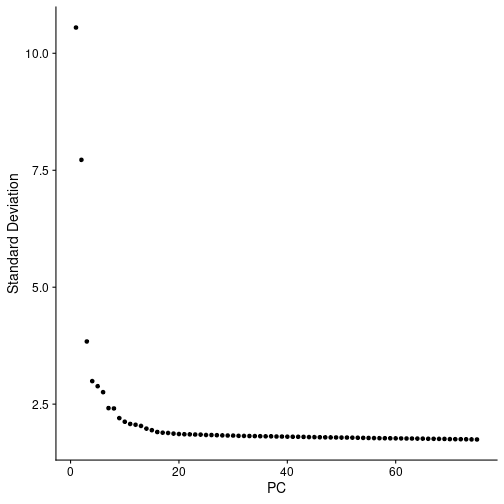
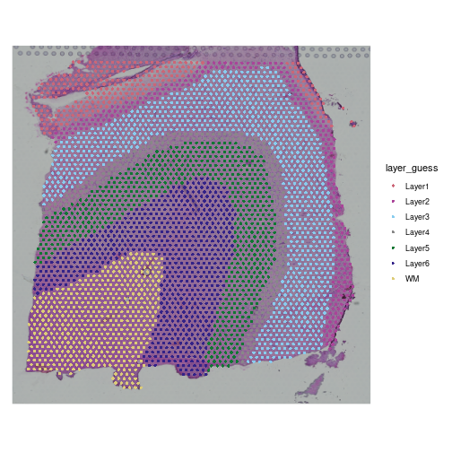
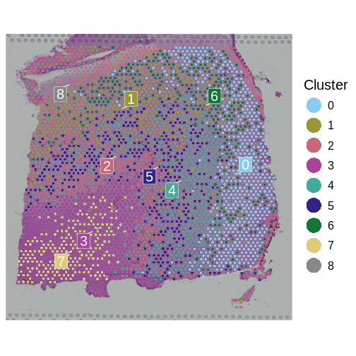
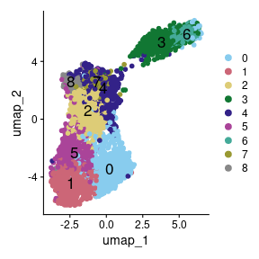
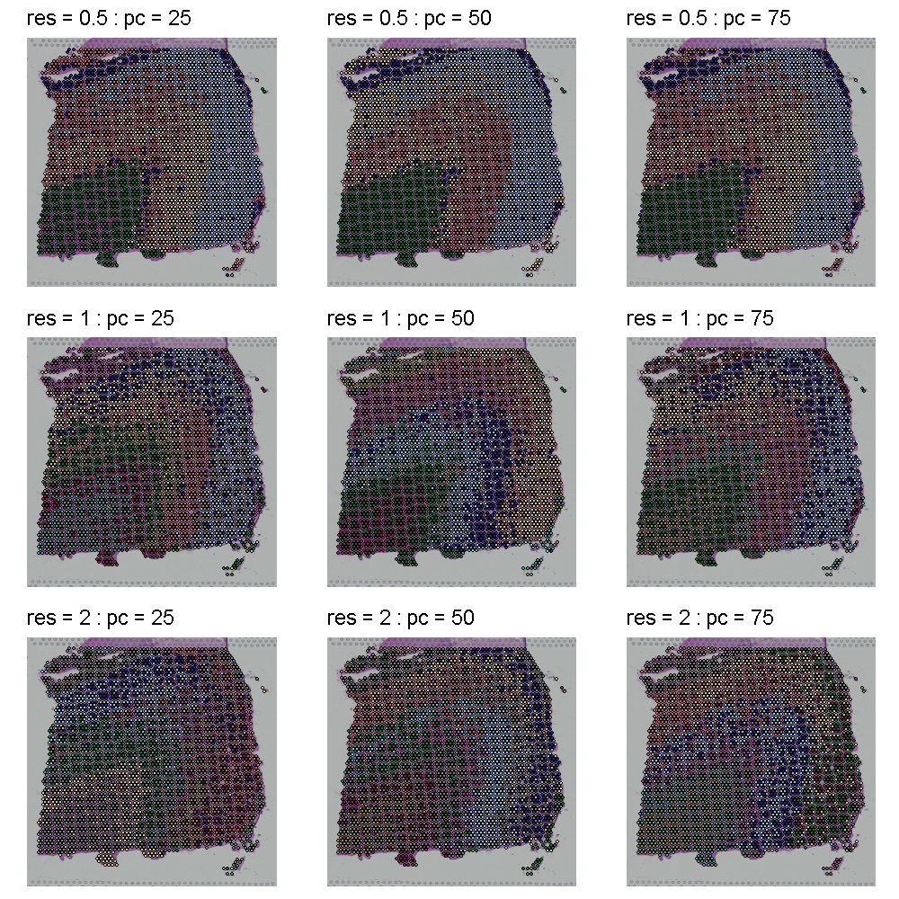
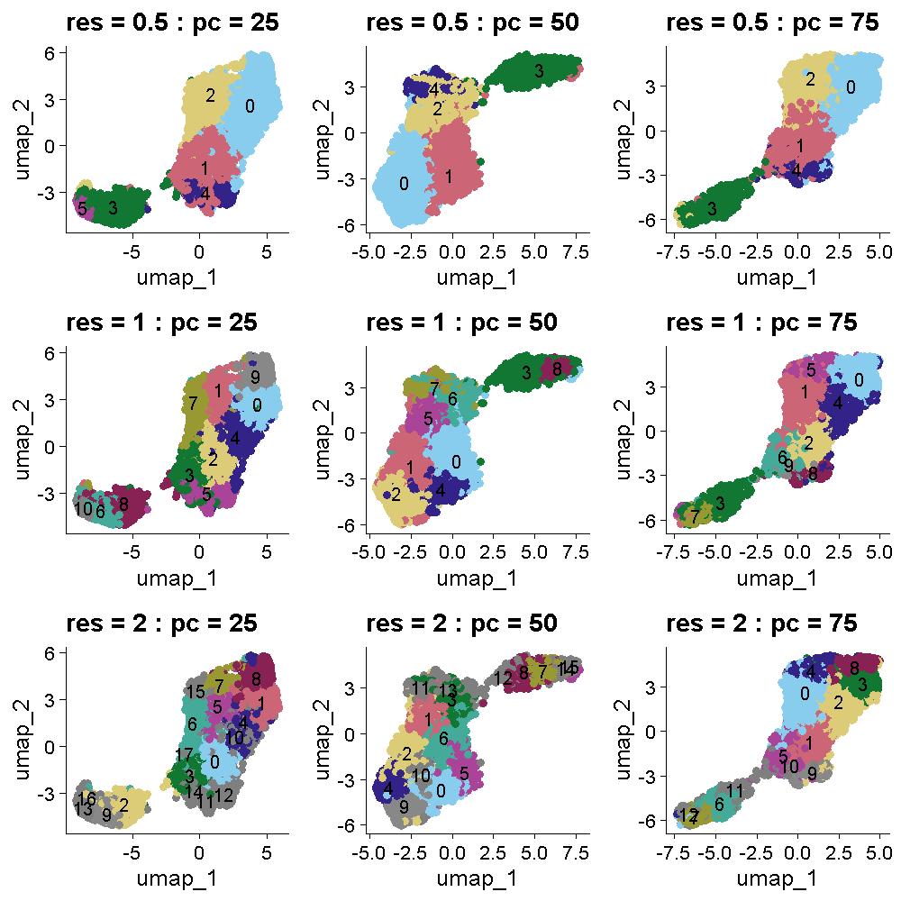

---
title: 'Feature Selection, Dimensionality Reduction, and Spot Clustering'
teaching: 75
exercises: 10
---

:::::::::::::::::::::::::::::::::::::: questions 

- Why is feature selection important in spatial transcriptomics?
- What are the implications of using different proportions of highly variable 
genes (HVGs) in data analysis?
- Why is feature selection in spatial transcriptomics not typically necessary 
with normalization techniques like SCTransform?
- How do PCA and UMAP differ in their approach to dimensionality reduction in 
spatial transcriptomics?
- What advantages do linear methods like PCA offer before applying nonlinear 
methods like UMAP?
- How do these dimensionality reduction techniques impact downstream analysis 
such as clustering and visualization?

::::::::::::::::::::::::::::::::::::::::::::::::

::::::::::::::::::::::::::::::::::::: objectives

- Identify appropriate feature selection methods for different normalization 
techniques in spatial transcriptomics.
- Evaluate the effects of varying the proportion of highly variable genes on the
resolution of clustering and PCA outcomes.
- Understand the rationale behind the dependency of feature selection on 
specific normalization methods like NormalizeData.
- Differentiate between linear and nonlinear dimensionality reduction methods 
and their applications in spatial transcriptomics.
- Implement PCA to preprocess data before applying UMAP to enhance 
interpretability and structure recognition.
- Assess the effectiveness of each method in revealing spatial and molecular 
patterns within the data.

::::::::::::::::::::::::::::::::::::::::::::::::


## Understanding the Morphology of your Tissue

In any analysis, it is important that you understand the structure and cell 
types in the tissue which you are analyzing. While it would be ideal to have
an unbiased analysis that uses normalizations and clustering methods to 
automatically assign cell types and define tissue structure, in practice we
adjust these parameters based on the tissue structure that we expect to find.

## Understanding Feature Selection in Spatial Transcriptomics

Feature selection in spatial transcriptomics is essential for reducing the 
dimensionality of high-dimensional datasets, enhancing model performance, and 
improving interpretability. This process is crucial because it helps in 
minimizing computational demands, reducing noise, and speeding up downstream 
analyses like clustering and principal components analysis (PCA). By focusing on 
a subset of genes that show significant variability or are biologically 
relevant, researchers can achieve more robust and generalizable models, draw 
clearer conclusions, and facilitate hypothesis testing.

### Choosing Feature Selection Methods

#### Importance of High Variable Gene Selection

Feature selection methods such as variance stabilizing transformation (VST) and 
mean-variance plotting are crucial for refining the dataset to include genes 
that exhibit meaningful variability across different spatial regions. These 
methods help focus on genes that are most informative for downstream analyses 
like clustering and dimensionality reduction.

### Feature Selection with `NormalizeData`

When using normalization methods like `NormalizeData`, which focuses on scaling 
gene expression data without variance stabilization, applying feature selection 
becomes essential. This method requires the selection of highly variable genes 
to enhance the analysis, particularly in clustering and PCA. Typically, you will 
select in the range of 2,000 to 5,000 highly variable genes.

### Feature Selection with `SCTransform`

`SCTransform`, a normalization method, adjusts gene expression data to 
stabilize the variance, and it also provides default feature selection. 
This method ensures that the genes retained are already adjusted for technical 
variability, highlighting those with biological significance.

The `SCTransform` selects 3,000 variable features by default. We will use those 
variable features to calculate *principal components* (PCs) of the gene 
expression data. As always, we must first scale (or standardize) the normalized 
counts data. 

::::::::::::::::::::::::::::::::::::: challenge 

## Challenge 1: Number of Variable Genes

How do you think that your results would be affected by selecting too few 
highly variable genes? What about too many highly variable genes?

:::::::::::::::::::::::: solution 

Too few variable genes may underestimate the variance between spots and tissue
sections and would reduce our ability to discern tissue structure. Too many
variable genes would increase computational time and might add noise to the 
analysis.

::::::::::::::::::::::::::::::::::
  
::::::::::::::::::::::::::::::::::::::::::::::

### Dimensionality Reduction using Principal Components

Dimensionality reduction is a crucial step in managing high-dimensional spatial 
transcriptomics data, enhancing analytical clarity, and reducing computational 
load. Linear methods like PCA and nonlinear methods like UMAP each play distinct
roles in processing and interpreting complex datasets.

PCA is a linear technique that reduces dimensionality by transforming data into 
a set of uncorrelated variables called *principal components* (PCs). This method 
efficiently captures the main variance in the data, which is vital for 
preliminary data exploration and noise reduction.

In order to cluster the spots by similarity, we use PCs to reduce the number of 
dimensions in the data. Using a smaller number of PCs allows us to capture the 
variability in the dataset while using a smaller number of dimensions. The PCs 
are then used to cluster the spots by similarity.


``` r
sct_st <- ScaleData(sct_st) %>%
               RunPCA(npcs = 75, verbose = FALSE)
```

``` output
Centering and scaling data matrix
```

In the command above, we specifically asked Seurat to calculate 75 principal 
components. There are thousands of genes and we know that we don't need to 
calculate all PCs. By default, the 
[`RunPCA`](https://satijalab.org/seurat/reference/runpca) method calculates 50 
PCs. Let's make an elbow plot of the number of PCs versus the standard deviation 
explained by each PC. Traditionally, there is a bend in the curve which 
indicates that adding more PCs doesn't account for more of the variance.


``` r
ElbowPlot(sct_st, ndims = 75)
```



From the plot above, we would normally select somewhere between 10 and 20 PCs 
because there seems to be little benefit in adding more PCs. Adding more PCs 
does not seem to add more explanatory variance. 

But in spatial transcriptomics, the elbow plot often does not tell the whole 
story. We want to select a number of PCs such that we are able to discern the
structure and cell type composition of our tissue. So it is better to try a 
range of number of PCs.

For now, let's use all 75 PCs.


``` r
n_pcs = 75
```

In the next step, we will cluster the spots based on expression similarity 
using the principal components that we just generated. We will use Seurat's
[`FindNeighbors`](https://satijalab.org/seurat/reference/findneighbors) and 
[`FindClusters`](https://satijalab.org/seurat/reference/findclusters) functions.
`FindNeighbors` find the K nearest neighbors of each spot in the dataset. The
default values is to use the 20 nearest neighbors in the dataset and we will
use this value in this lesson. However, as with the number of features used to
create the PCs, this is another parameter that is worth varying before 
proceeding with your analysis.


``` r
sct_st <- FindNeighbors(sct_st, 
                        reduction = "pca", 
                        dims      = 1:n_pcs) %>% 
               FindClusters(resolution = 1)
```

``` output
Computing nearest neighbor graph
```

``` output
Computing SNN
```

``` output
Modularity Optimizer version 1.3.0 by Ludo Waltman and Nees Jan van Eck

Number of nodes: 3633
Number of edges: 198594

Running Louvain algorithm...
Maximum modularity in 10 random starts: 0.7227
Number of communities: 9
Elapsed time: 0 seconds
```

The clustering has added a new column to the spot metadata in the Seurat object
called `seurat_clusters`. Let's look the metadata to see this.


``` r
head(sct_st[[]])
```

``` output
                      orig.ident nCount_Spatial nFeature_Spatial in_tissue
AAACAAGTATCTCCCA-1 SeuratProject           8458             3586         1
AAACAATCTACTAGCA-1 SeuratProject           1667             1150         1
AAACACCAATAACTGC-1 SeuratProject           3769             1960         1
AAACAGAGCGACTCCT-1 SeuratProject           5433             2424         1
AAACAGCTTTCAGAAG-1 SeuratProject           4278             2264         1
AAACAGGGTCTATATT-1 SeuratProject           4004             2178         1
                   array_row array_col pxl_row_in_fullres pxl_col_in_fullres
AAACAAGTATCTCCCA-1        50       102               8468               9791
AAACAATCTACTAGCA-1         3        43               2807               5769
AAACACCAATAACTGC-1        59        19               9505               4068
AAACAGAGCGACTCCT-1        14        94               4151               9271
AAACAGCTTTCAGAAG-1        43         9               7583               3393
AAACAGGGTCTATATT-1        47        13               8064               3665
                   percent.mt keep layer_guess cell_count nCount_SCT
AAACAAGTATCTCCCA-1   16.63514 TRUE      Layer3          6       5167
AAACAATCTACTAGCA-1   12.23755 TRUE      Layer1         16       3404
AAACACCAATAACTGC-1   11.40886 TRUE          WM          5       3828
AAACAGAGCGACTCCT-1   24.22234 TRUE      Layer3          2       4683
AAACAGCTTTCAGAAG-1   15.21739 TRUE      Layer5          4       4228
AAACAGGGTCTATATT-1   15.50949 TRUE      Layer6          6       3991
                   nFeature_SCT SCT_snn_res.1 seurat_clusters
AAACAAGTATCTCCCA-1         3192             0               0
AAACAATCTACTAGCA-1         1264             2               2
AAACACCAATAACTGC-1         1941             7               7
AAACAGAGCGACTCCT-1         2393             6               6
AAACAGCTTTCAGAAG-1         2239             5               5
AAACAGGGTCTATATT-1         2148             3               3
```

We previously discussed the layer annotations provided by Maynard and 
colleagues. We added them to our Seurat object and plotted them. Let's look at 
them again to compare them to our clusters.


``` r
SpatialDimPlotColorSafe(sct_st[, !is.na(sct_st[[]]$layer_guess)], "layer_guess") +
  labs(fill="Layer") 
```



The authors describe six layers arranged from the upper right to the lower left,
and a white matter (WM) later. At this stage of the analysis, we have nine 
clusters, but they do not show the clear separation of the ground truth in the
source publication.

We will now plot the spots in the tissue, colored by the clusters which we 
have identified in `seurat_clusters` to evaluate the quality of the cluster 
identities by looking for the clarity of the stripes forming each layer.


``` r
SpatialDimPlotColorSafe(sct_st, "seurat_clusters") + labs(fill="Cluster") 
```



How many layers do we have compared to the publication? What do you think about
the quality of the layers in this plot? Are there clear layers in the tissue?

Another way for us to look at the clusters it to plot them in a Uniform Manifold
Approximation and Projection (UMAP). UMAP is a non-linear dimension reduction 
technique that can be used to visualize data. This is often used in single-cell
RNASeq to identify different cell types. Here, each spot is potentially composed
of more than one cell type, so the clustering may not be as clear.


``` r
num_clusters <- length(unique(sct_st[[]]$seurat_clusters))
color_pal    <- setNames(carto_pal(num_clusters, "Safe"), 0:(num_clusters - 1))

sct_st <- RunUMAP(sct_st, 
                  reduction = 'pca', 
                  dims      = 1:n_pcs, 
                  verbose   = FALSE)

UMAPPlot(sct_st, 
         label      = TRUE,
         cols       = color_pal,
         pt.size    = 2,
         label.size = 6)
```



We have made some decisions above which might affect the quality of our spot 
clusters, including the number of nearest neighbors, the number of variable 
features, the number of PCs, and the cluster resolution. As we have mentioned, 
it is critical to have some understanding of the structure of the tissue that 
you are analyzing. In the absence of "ground truth", you will need to try 
several different parameters and look at how the clusters group in your tissue. 
Below, we have included code which plots the tissue with different numbers of 
nearest neighbors, principal components, and cluster resolutions. We will not 
run this code because it takes a long time to run, but we show the output below 
this code block.


``` r
# Set several cluster resolution values.
resol <- c(0.5, 1, 2)
# Set several numbers of principal components.
npcs  <- c(25, 50, 75)

num_clusters <- 12
color_pal    <- setNames(carto_pal(num_clusters, "Safe"), 0:(num_clusters - 1))

umap_plots <- vector('list', length(resol) * length(npcs))
plots      <- vector('list', length(resol) * length(npcs))

for(i in seq_along(resol)) {
  for(j in seq_along(npcs)) {

    index     <- (i-1) * length(npcs) + j
    print(paste('Index =', index))

    sct_st <- FindNeighbors(sct_st, 
                            reduction = "pca", 
                            dims      = 1:npcs[j]) %>%
                   FindClusters(resolution = resol[i]) %>%
                   RunUMAP(reduction = 'pca', 
                           dims      = 1:npcs[j],
                           verbose   = FALSE)

    umap_plots[[index]] <- UMAPPlot(sct_st, label = TRUE, cols = color_pal, 
                                    pt.size = 2, label.size = 4) +
                             ggtitle(paste("res =", resol[i], ": pc =", npcs[j])) +
                             theme(legend.position = "none")

    plots[[index]]      <- SpatialDimPlot(sct_st, 
                                          group.by = "seurat_clusters", 
                                          cols = color_pal) +
                          ggtitle(paste("res =", resol[i], ": pc =", npcs[j])) + 
                          theme(legend.position = "none")

  } # for(j)

} # for(i)

png(file.path('episodes', 'fig', 'tissue_cluster_resol.png'),
    width = 1000, height = 1000, res = 128)
print(gridExtra::grid.arrange(grobs = plots, nrow = 3))
dev.off()

png(file.path('episodes', 'fig', 'umap_cluster_resol.png'),
    width = 1000, height = 1000, res = 128)
print(gridExtra::grid.arrange(grobs = umap_plots, nrow = 3))
dev.off()
```

The plot below shows the clusters as colors overlayed on the tissue. Each row
shows a different cluster resolution and each column shows the number of PCs. 

{alt="Tissue Clustering showing the tissue layers at different resolutions and number of PCs"}

The plot below shows the UMAP clustering for the same set of parameters in the
same order. The cluster colors are the same in the plots above and below. 
Increasing the cluster resolution increases the number of clusters.

{alt="UMAP Clustering with Different Numbers of PCs and Clustering Resolutions"}

::::::::::::::::::::::::::::::::::::: challenge 

## Challenge 1: Select cluster resolution and number of PCs

Look at the two plots above which show the tissue and UMAP clusters at 
different cluster resolutions and number of PCs. Think about which 
settings seem to produce clustering that matches the expectations from the
publication. Turn to the person next to you and discuss your opinions about 
which settings to use.

:::::::::::::::::::::::: solution 

## Solution 1
 
All of the plots in the tissue clustering show layers which broadly conform to
the publication's "ground truth." In the top row at a resolution of 0.5, we see
about four layers with varying levels of clarity, depending on the number of 
PCs. As we move down in the tissue clustering plot, the layers become clearer at 
a resolution of 1, but then become less clear at a resolution of 2 in the bottom 
row.
When we look at the corresponding row in the UMAP plots, we see that the white
matter is clearly separated in all of the plots. The number of clusters increases
with increasing cluster resolution, with the middle row (cluster resolution = 1),
having close to seven layers, like the publication ground truth. The middle
plot in the middle row has nine clusters, which is also close to the publication.

::::::::::::::::::::::::::::::::::
:::::::::::::::::::::::::::::::::::::::::::::::::::

We selected a cluster resolution of 0.8 and 50 PCs for the following work.


``` r
sct_st <- FindNeighbors(sct_st, 
                        reduction = "pca", 
                        dims      = 1:50) %>% 
               FindClusters(resolution = 0.8)
```

``` output
Modularity Optimizer version 1.3.0 by Ludo Waltman and Nees Jan van Eck

Number of nodes: 3633
Number of edges: 175530

Running Louvain algorithm...
Maximum modularity in 10 random starts: 0.7508
Number of communities: 8
Elapsed time: 0 seconds
```


``` r
SpatialDimPlotColorSafe(sct_st, "seurat_clusters") +
  ggtitle(label = "Tissue Clusters: 50 PCs, resol = 0.8") +
  labs(fill = "Cluster")
```


::::::::::::::::::::::::::::::::::::: keypoints 

- Feature selection is a crucial step in spatial transcriptomics analysis, particularly for non-variance-stabilizing normalization methods like `NormalizeData`.
- Techniques such as VST and mean-variance plotting enable researchers to focus on genes that provide the most biological insight.
- Different proportions of highly variable genes and feature selection methods can significantly influence the analytical outcomes, emphasizing the need for tailored approaches based on the specific characteristics of each dataset.
- Linear dimensionality reduction methods like PCA are crucial for initial data simplification and noise reduction.
- Nonlinear methods like UMAP are valuable for detailed exploration of data structures post-linear preprocessing.
- The sequential application of PCA and UMAP can provide a comprehensive view of the spatial transcriptomics data, leveraging the strengths of both linear and nonlinear approaches.

::::::::::::::::::::::::::::::::::::::::::::::::


