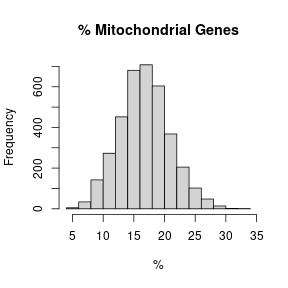
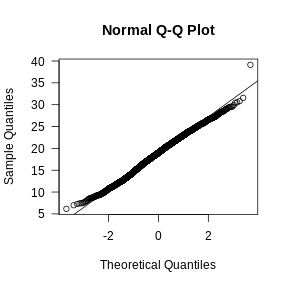
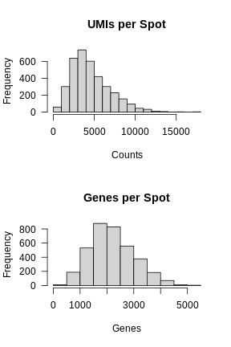
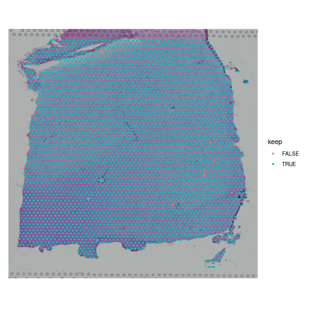
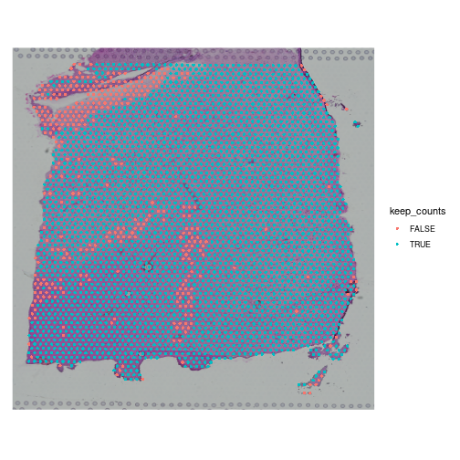
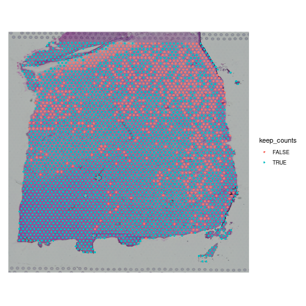
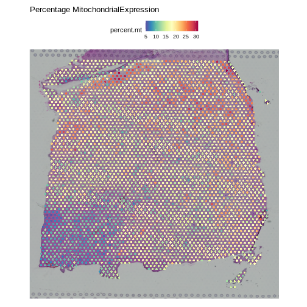

:::::::::::::::::::::::::::::::::::::: questions 

- How do I remove low-quality spots?
- What kinds of problems produce low-quality spots?
- What happens if I skip quality control and proceed with analysis?

::::::::::::::::::::::::::::::::::::::::::::::::

::::::::::::::::::::::::::::::::::::: objectives

- Understand how to look for low quality spots.
- Decide whether to retain or remove low quality spots.

::::::::::::::::::::::::::::::::::::::::::::::::


## Introduction

Spatial transcriptomics involves a complex process that may involve some
technical failures. If the processing of the entire slide fails, it should be
obvious due to a large number of gene appearing in spots outside of the
tissue or low UMIs across the whole tissue.

However, there can also be variation in spot quality in a slide that has
largely high-quality spots. These artifacts are much rarer than in single-cell
transcriptomics because the process of tissue sectioning is less disruptive
than tissue dissociation. Because of this, we recommend light spot filtering.

There are three metrics that we will use to identify and remove low-quality spots:

1. Mitochondrial gene expression,
2. Total UMI counts,
3. Number of detected genes.

During tissue processing, it is possible that some cells will be lysed, 
spilling out the transcripts, but retaining the mitochondria. These spots will
appear with much higher mitochondrial gene expression.
High UMI counts or number of detected genes might also indicate spots with
bleed over of lysed content from neighboring cells.

There may be regions of the slide with artifacts introduced
during slide preparation. These include tearing and folding of the tissue.
As mentioned above, the 10x Space Ranger pipeline automatically segments the
tissue boundary. This generally performs well at a large scale. However, at high
resolution, it may fail to properly assign spots within small tears or along the
jagged edge to the background. Such spots might be identified by low UMI counts
or number of detected genes. Conversely, folded tissue may have a higher
density of cells, which could result in high UMI counts or number of detected genes.
Pathologist annotation of H&E image can flag artifactual regions that are then
excluded from downstream analysis. Image processing techniques may also be
able to automatically identify and exclude artifactual regions, particularly folds.
Using pathologist annotation or image processing to identify tissue abnormalities
is less common than using the simple data-driven metrics considered here,
and we do not discuss them further.

These metrics may be tissue-dependent. In some tissues, there may be
biological reasons for differential expression across the tissue. For example,
in a cancer sample, mitochondrial or total gene expression may vary between
stromal and tumor regions. It will be important for you to familiarize yourself 
with the structure of the tissue that you are analyzing in order to make
rational judgments about filtering.

## Filtering by Mitochondrial Gene Count

In single-cell RNA sequencing experiments, the tissue is digested and the cells
are dissociated. This mechanical disruption is stressful to the cells and some
of them are damaged in the process. Elevated levels of mitochondrial genes often
indicate cell death or damage because, when a cell's membrane is compromised, 
it loses most cytoplasmic content while retaining mitochondrial RNA. Therefore, 
spots with high mitochondrial RNA may represent damaged or dying cells, and 
their exclusion helps focus the analysis on healthy, intact cells. 

More details on this relationship can be found in the 
[literature on mitochondrial DNA and cell death](https://genomebiology.biomedcentral.com/articles/10.1186/s13059-016-0888-1).

However, in spatial transcriptomics, the tissue is either frozen or 
formalin-fixed and there is much less mechanical disruption of the tissue. 
Because of this, we are skeptical of the value of filtering spots based on
mitochondrial gene counts.

For completeness, we show how to obtain the mitochondrial genes, calculate the
percentage of counts produced by these genes in each spot, and add this to
the Seurat object metadata.

We will search the gene symbols in the feature metadata to identify 
mitochondrial genes. We do not need to find all genes in these
categories, so we will search for genes with symbols that start with "MT".

The Seurat object is designed to be flexible and may contains several data types.
For example, it may contain both gene counts and open chromatin peaks. In this 
analysis, the Seurat object only contains gene counts. The different types
of data are called "Layers" in Seurat and may be accessed using the 
[Layers](https://satijalab.github.io/seurat-object/reference/Layers.html) 
function.


``` r
Layers(filter_st)
```

``` output
[1] "counts"
```

This tells us that the "filter_st" object only contains one data Layer called
"counts". We can access this using the 
[LayerData](https://satijalab.github.io/seurat-object/reference/Layers.html)
function using "counts" as an argument.


``` r
counts <- LayerData(filter_st, 'counts')
head(counts)[,1:5]
```

``` output
6 x 5 sparse Matrix of class "dgCMatrix"
            AAACAAGTATCTCCCA-1 AAACAATCTACTAGCA-1 AAACACCAATAACTGC-1
MIR1302-2HG                  .                  .                  .
AL627309.1                   .                  .                  .
AL669831.5                   .                  .                  .
FAM87B                       .                  .                  .
LINC00115                    .                  .                  .
FAM41C                       .                  .                  .
            AAACAGAGCGACTCCT-1 AAACAGCTTTCAGAAG-1
MIR1302-2HG                  .                  .
AL627309.1                   .                  .
AL669831.5                   .                  .
FAM87B                       .                  .
LINC00115                    .                  .
FAM41C                       .                  .
```

The output above may look odd to you since there are no numbers. Notice that
the text above the table says "sparse Matrix". Many of the counts in the file
are likely to be zero. Due to the manner in which numbers are stored in 
computer memory, a zero takes up as much space as a number. If we had to store
all of these zeros, it would consume a lot of computer memory. A sparse matrix
is a special data structure which only stores the non-zero values. In the table
above, each dot (.) represents a position with zero counts.

:::::::::::::::::::::::::::::::::::::::::::::::::::::::::::::::::::: instructor

You don't have to have the students type out the next block. It may be better
to let them focus on the concept rather than typing.

:::::::::::::::::::::::::::::::::::::::::::::::::::::::::::::::::::::::::::::::

If we look at another part of the "counts" matrix, we can see numbers.


``` r
counts[20000:20005,1:5]
```

``` output
6 x 5 sparse Matrix of class "dgCMatrix"
       AAACAAGTATCTCCCA-1 AAACAATCTACTAGCA-1 AAACACCAATAACTGC-1
DNAJB1                  .                  .                  .
TECR                    3                  1                  .
NDUFB7                  3                  1                  1
ZNF333                  .                  .                  .
ADGRE2                  .                  .                  .
OR7C1                   .                  .                  .
       AAACAGAGCGACTCCT-1 AAACAGCTTTCAGAAG-1
DNAJB1                  1                  .
TECR                    2                  1
NDUFB7                  2                  4
ZNF333                  .                  .
ADGRE2                  .                  .
OR7C1                   .                  .
```

As you can see in the table above, the gene symbols are stored in the rownames 
of "counts". We will find find mitochondrial genes by searching for gene symbols
which start with "MT".


``` r
mito_pattern <- '^[Mm][Tt]-'
mito_genes   <- rownames(counts)[grep(mito_pattern, rownames(counts))]
mito_genes
```

``` output
 [1] "MT-ND1"  "MT-ND2"  "MT-CO1"  "MT-CO2"  "MT-ATP8" "MT-ATP6" "MT-CO3" 
 [8] "MT-ND3"  "MT-ND4L" "MT-ND4"  "MT-ND5"  "MT-ND6"  "MT-CYB" 
```

We now have a set of mitochondrial genes. We will use these genes to estimate the 
percentage of gene counts expressed by mitochondrial genes in each cell 
and add this to the Seurat object. We will pass the mitochondrial gene 
symbols into
[PercentageFeatureSet](https://satijalab.org/seurat/reference/percentagefeatureset), 
which will perform the calculation for us.


``` r
filter_st[["percent.mt"]] <- PercentageFeatureSet(filter_st, pattern = mito_pattern)
```

This syntax adds a new column called "percent.mt" to the spot metadata.


``` r
colnames(filter_st@meta.data)
```

``` output
[1] "orig.ident"         "nCount_Spatial"     "nFeature_Spatial"  
[4] "in_tissue"          "array_row"          "array_col"         
[7] "pxl_row_in_fullres" "pxl_col_in_fullres" "percent.mt"        
```


:::::::::::::::::::::::::::::::::::::::::::::::::::::::::::::::::::: instructor

There is no need to have students type out the figure titles and axis labels.

:::::::::::::::::::::::::::::::::::::::::::::::::::::::::::::::::::::::::::::::

Let's look at histograms of the ribosomal and mitochondrial gene percentages.


``` r
hist(FetchData(filter_st, "percent.mt")[,1],   main = "% Mitochondrial Genes",
     xlab = "%")
```



In these plots, we are looking for spots which are outside of a normal
distribution. It is difficult to generalize how to select a filtering 
threshold. Some tissue or cell types may have higher mitochondrial gene expression.
Further, heterogeneous tissues may have subsets of cells with differing levels
of mitochondrial gene expression. 

Let's visually check whether the mitochondrial gene expression is normally
distributed.


``` r
mito_expr <- FetchData(filter_st, "percent.mt")[,1]
qqnorm(mito_expr, las = 1)
qqline(mito_expr)
```



In this case, there may be a reason to filter out spots with greater than 35% 
mitochondrial counts.

## Filter by UMI Count and Number of Detected Genes

In the previous lesson, we plotted number of UMIs and genes detected spatially
across the tissue. Let's plot these values again, but this time as a histogram.

:::::::::::::::::::::::::::::::::::::::::::::::::::::::::::::::::::: instructor

There is no need to have students type out the figure titles and axis labels.

:::::::::::::::::::::::::::::::::::::::::::::::::::::::::::::::::::::::::::::::


``` r
layout(matrix(1:2, ncol = 1))
hist(FetchData(filter_st, "nCount_Spatial")[,1],
     main = 'UMIs per Spot', xlab = 'Counts', las = 1)
hist(FetchData(filter_st, "nFeature_Spatial")[,1], 
     main = 'Genes per Spot', xlab = 'Genes', las = 1)
```



Again, most of the spots fall within a reasonable distribution. The right tail
of the distribution is not very thick. We might filter spots with over 14,000
UMIs or 3,000 genes. We will use these thresholds to add a "keep" column
to the Seurat object metadata.

First, we will create variables for each threshold. While we could type the
numbers directly into the logical comparison statements, creating variables
makes it clear what each number represents.


``` r
mito_thr     <- 32
counts_thr   <- 14000
features_thr <- 5000
```

Next, we will create a "keep" variable which will be TRUE for spots that
we want to keep.


``` r
keep <- FetchData(filter_st, "percent.mt")[,1]       < mito_thr
keep <- FetchData(filter_st, "nCount_Spatial")[,1]   < counts_thr   & keep
keep <- FetchData(filter_st, "nFeature_Spatial")[,1] < features_thr & keep

filter_st$keep <- keep
```

Now let's plot the spots on the tissue and color them based on whether we will
keep them.


``` r
SpatialDimPlot(filter_st, group.by = "keep")
```



When you examine the spots that have been flagged, it is important to look for 
patterns. If a contiguous section of tissue contains spots that will be removed,
it is worth looking at the histology slide to see if there are structures that
correlate with the removed spots. If it is a section of necrotic tissue, then, 
depending on your experimental question, you may want to remove those spots. 
But you should always look for patterns in the removed spots and convince
yourself that they are not biasing your results.

Note that we will only remove a few spots in this filtering step.


``` r
table(FetchData(filter_st, "keep")[,1])
```

``` output

FALSE  TRUE 
    6  3633 
```

We can remove the spots directly using the following syntax. In this case, the
"columns" of the Seurat object correspond to the spots.


``` r
filter_st <- filter_st[,keep]
```

::::::::::::::::::::::::::::::::::::: challenge 

## Challenge 1: Change the total counts spot filtering threshold.

1. Make a copy of the seurat object.
1. Change the threshold for the number of UMIs per spot to keep spots with
**more** than 2000 counts. Note that we are filtering on the lower side of
the distribution. 
1. Add new variable called "keep_counts" to the Seurat object.
1. Plot the spot overlaid on the tissue section, colored
by whether you are keeping them. 

Is there a pattern to the removed spots that seems to correlate with the tissue
structure?

:::::::::::::::::::::::: solution 

## Solution 1
 

``` r
obj             <- filter_st
new_counts_thr  <- 2000
keep_counts     <- FetchData(obj, "nCount_Spatial")[,1] > new_counts_thr
obj$keep_counts <- keep_counts
SpatialDimPlot(obj, group.by = "keep_counts")
```



Note that the spots that we have flagged seem to correspond to stripes in the
tissue section. These may be regions of the brain which have lower levels of
gene expression, so we may want to revise or remove this threshold. Overall,
this exercise shows that it is important to use judgement when filtering spots.

:::::::::::::::::::::::::::::::::
:::::::::::::::::::::::::::::::::::::


::::::::::::::::::::::::::::::::::::: challenge 

## Challenge 2: Change the mitochondrial spot filtering thresholds.

1. Make a copy of the seurat object.
1. Change the threshold for the percent mitochondrial expression per spot to 
keep spots with **less** than 25% mitochondrial expression. This might happen
if you decide that too much mitochondrial expression indicates some technical
error.
1. Add new variable called "keep_counts" to the Seurat object.
1. Plot the spot overlaid on the tissue section, colored
by whether you are keeping them. 

Is there a pattern to the removed spots that seems to correlate with the tissue
structure?

:::::::::::::::::::::::: solution 

## Solution 2
 

``` r
obj          <- filter_st
new_mito_thr <- 20
keep_counts  <- FetchData(obj, "percent.mt")[,1] < new_mito_thr
obj$keep_counts <- keep_counts
SpatialDimPlot(obj, group.by = "keep_counts")
```



Note that the spots that we have flagged are largely outside of the lower left.
Later in the lesson, we will find that this is the "white matter", and this 
region has different expression from the rest of the tissue section. In fact, 
mitochondrial expression in general seems to be higher in the upper right area.


``` r
SpatialFeaturePlot(obj, features = "percent.mt") +
  labs(title = "Percentage MitochondrialExpression")
```



``` r
rm(obj)
```

:::::::::::::::::::::::::::::::::
:::::::::::::::::::::::::::::::::::::


::::::::::::::::::::::::::::::::::::: keypoints 

- Spot filtering should be light.
- Inspect the spots that you are filtering to confirm that you are not discarding
important tissue structures.

::::::::::::::::::::::::::::::::::::::::::::::::


